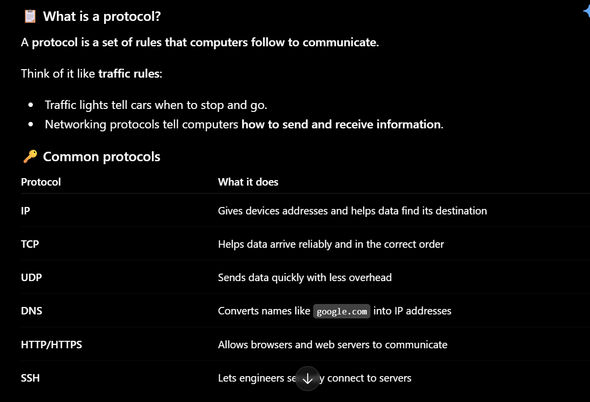
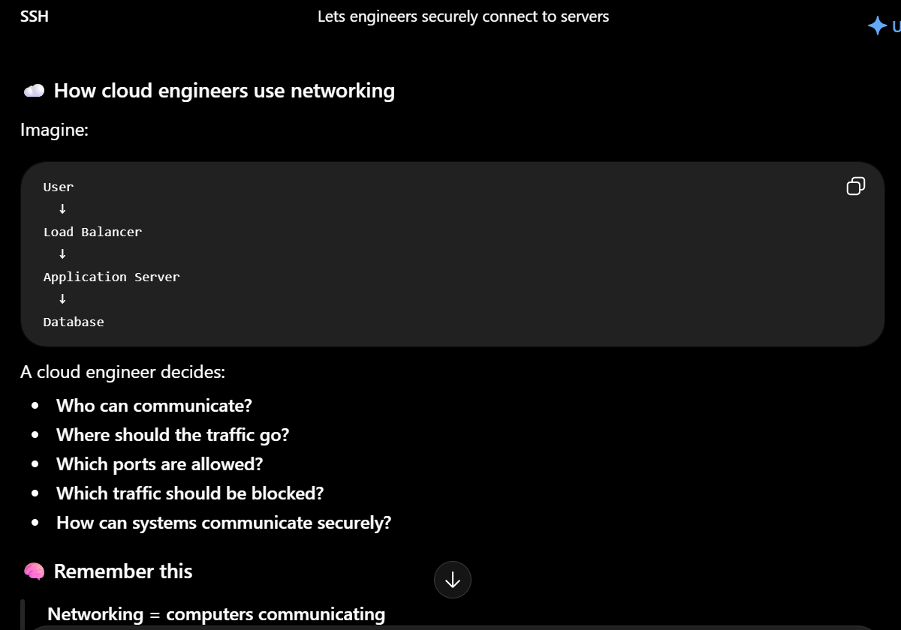
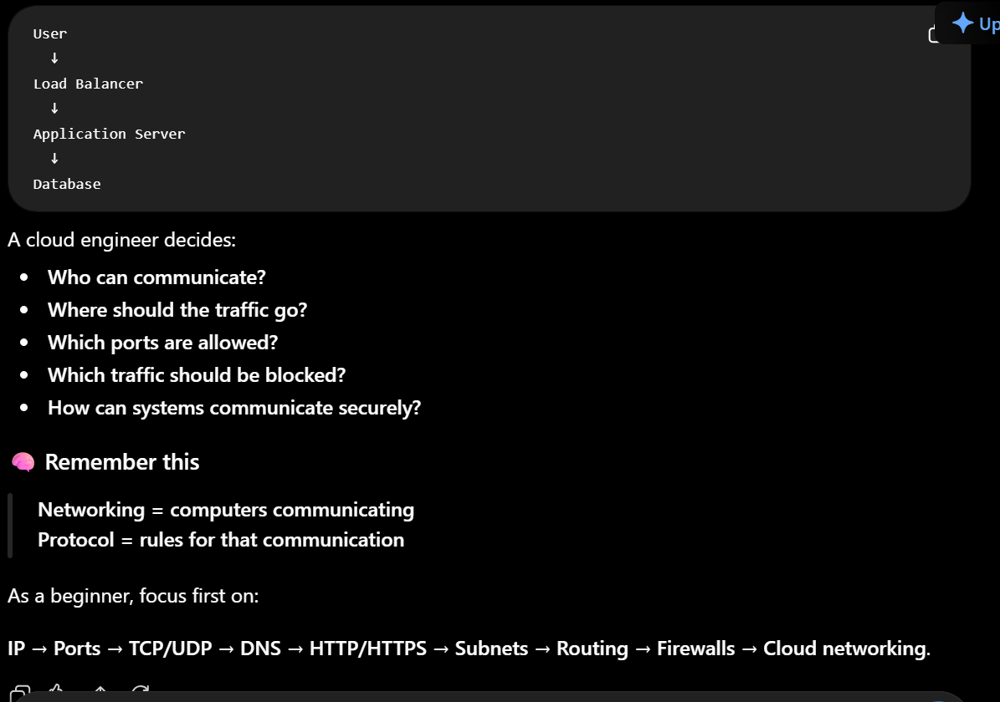

# Week 00 - Internet and Networking

Part of the DevOps Micro Internship (DMI) Cohort 3 with Agentic AI

---

# 🧑‍💻 Task 1: Using ChatGPT as Your Learning Assistant

## Scenario

You're new to DevOps and will frequently encounter technical questions. ChatGPT can be your learning companion.

## Your Task

Write a clear ChatGPT prompt to help you understand:

> "What is a protocol in networking? Explain with a simple real-life example."

Take a screenshot of your interaction showing:

* Your detailed prompt (with clear expectations)
* ChatGPT's simplified response with an example

## Screenshot

Save your screenshot in the `screenshots` folder and update the file name below.







Replace `task-1-chatgpt.png` with your actual screenshot file name.

---

## What I Learned (2–3 lines)

During the query process, I learned how to use ChatGPT to understand complex technical concepts by asking questions and requesting simpler explanations. I learned that breaking a topic into smaller parts makes it easier to understand, especially when starting a new subject like cloud networking.

From the answers, I learned that networking is the process of connecting computers and systems so they can communicate with each other. I also learned that a protocol is a set of rules that computers follow to communicate and exchange information.

I was introduced to important networking protocols such as IP, TCP, UDP, DNS, HTTP/HTTPS, and SSH**, and learned the basic purpose of each. I also gained an understanding of how networking is used in Cloud and DevOps Engineering, where servers, applications, databases, and users need to communicate securely.

Overall, the query helped me build a basic understanding of networking and showed me how protocols, IP addresses, ports, routing, and security work together to allow communication between systems in the cloud.

---

# 🌐 Task 2: Internet and Networking

## Scenario

Your friend is launching an online bookstore named **EpicReads**.

He asked you to explain how users globally can access his website hosted in Finland.

## Your Task

Write a short explanation (**100–150 words**) that includes:

* Packet Switching
* IP Address
* TCP/IP
* HTTP/HTTPS

💡 **Tip:** You may use ChatGPT (as demonstrated in Task 1) to refine your explanation.

## Answer

### How Users Access EpicReads Globally

When a user visits EpicReads, their request travels across the internet to the website hosted on a server in Finland. The process uses packet switching, where the request and website data are broken into small packets and sent across different network paths before being reassembled at the destination.

The server hosting EpicReads has an IP address, which acts like its digital address and helps networks identify where to send the packets. TCP/IP provides the basic rules for delivering these packets across the internet. TCP helps ensure that the data arrives reliably and in the correct order, while IP handles addressing and routing.

Finally, HTTP/HTTPS allows the user's browser and EpicReads' web server to communicate. HTTPS is preferred because it encrypts the communication, helping protect users' information while they browse and purchase books.


---

# 🏗️ Task 3: Application Architecture & Stack

## Scenario

EpicReads bookstore has two application versions:

### Two-Tier Application

* Frontend
* Database

### Three-Tier Application

* Frontend
* Backend
* Database

## Your Task

* Draw simple diagrams (hand-drawn or tool-based such as draw.io)
* Label each layer clearly
* List at least two common technologies or tools used for each layer
* Submit a screenshot or photo clearly showing your own drawing

## Diagram Screenshot / Photo

Save your diagram image in the `screenshots` folder and update the file name below.


Replace `task-3-diagram.png` with your actual diagram file name.

---

## Technologies Used

### Frontend

* React, 
* Vue.js, and HTML5/CSS3.

### Backend

* Node.js
* Python

### Database

* MySQL
* DynamoDB

---

# 🌍 Task 4: Domain Name & DNS (Basic Concepts)

## Scenario

Your friend's bookstore **EpicReads** is currently accessible through:

```text
52.172.142.222:3000
```

He purchased the domain:

```text
epicreads.com
```

## Your Task

In **50–100 words**, explain in your own words:

1. What is DNS (Domain Name System)?
2. Which DNS record type should be used to connect the domain to the given IP, and why?

## Answer

### DNS and EpicReads

DNS (Domain Name System) is like the internet’s phonebook. It converts easy-to-remember domain names, such as epicreads.com, into IP addresses that computers use to locate servers.

For EpicReads, an A record should be used because it connects a domain name to an IPv4 address. The A record would point epicreads.com to 52.172.142.222. However, the port 3000 is not included in a DNS record. Users would normally need to access the application through a URL that specifies the port, such as `http://epicreads.com:3000`, unless a web server or reverse proxy is configured to handle the port automatically.

---

# 💻 Task 5: Visual Studio Code Setup (Hands-on)

## Your Task

Install Visual Studio Code (if not already installed).

Take a screenshot of your VS Code environment showing:

* Terminal open inside VS Code
* Running a basic command:

### Windows

```powershell
dir
```

### Linux / macOS

```bash
pwd
ls
```

* Your selected VS Code theme clearly visible

⚠️ **Important:** The screenshot must show your username or another identifiable detail to confirm it is your environment.

## Screenshot

Save your screenshot in the `screenshots` folder and update the file name below.


Replace `task-5-vscode.png` with your actual screenshot file name.

---

# 🔗 Task 6: Publish Your Assignment as a LinkedIn Post

## Objective

Publishing on LinkedIn helps you:

* Build your professional online presence
* Reinforce your learning
* Document your DevOps journey publicly

## Your Task

Summarize your answers from Tasks 1–5 into a LinkedIn post.

Clearly structure your post into the following sections:

* ChatGPT
* Internet & Networking
* App Architecture
* DNS
* VS Code Setup

Add the following credit note at the end of your post:

> **P.S. This post is a part of DevOps Micro Internship with Agentic AI Cohort-3 by Pravin Mishra. You can start your DevOps journey by joining this Discord community: https://discord.pravinmishra.com/**

---

## LinkedIn Post URL

Paste your LinkedIn post URL here:

https://www.linkedin.com/posts/ransfordselormdzandu_cloudabrengineering-devopsabrengineering-activity-7465425169587625984-zhMf?utm_source=share&utm_medium=member_desktop&rcm=ACoAAEwl7_QBxhr73Ja5tGLqw7xByGHiHbrAk08

---

## LinkedIn Post Backup Copy

Paste the full text of your LinkedIn post here:

Demystifying the Network: How Data Moves Across the Web 

When we launch an application or visit an online store, a highly orchestrated sequence of networking rules makes it happen in milliseconds. Today, I understood the foundational mechanics that keep our modern web fast, reliable, and secure. Here is a summary of how the pieces work together.

How the Internet Works

Data doesn’t travel over the web as one heavy, continuous stream. Instead, Packet Switching breaks your information into small chunks (packets). These packets travel independently across global routers, finding the fastest path available, and cleanly reassemble at their final destination.

Internet & Networking
To keep this traffic orderly, devices rely on networking protocols, which are essentially standardized sets of rules or "shared languages" that dictate how data is formatted, routed, and received.

IP Addresses: Every device has a unique numerical label (like 192,168,0,1) so the network knows exactly where to deliver data.

TCP/IP Suite: The ultimate logistics engine. IP handles the routing between networks, while TCP guarantees that packets arrive safely, completely, and in the exact right order.

HTTP/HTTPS: The protocols governing how web browsers and servers communicate. HTTPS applies SSL/TLS encryption, protecting data from transit vulnerabilities and giving us the familiar browser padlock icon.

 App Architecture
Deploying an application involves mapping service endpoints securely. For example, if you are hosting a web application on a server, it often runs on a specific port (like port 3000). To expose this safely to production traffic, engineers utilize tools like reverse proxies or URL forwarding to manage the routing, abstract the port from the end-user, and handle SSL termination smoothly.

DNS (Domain Name System)
Computers communicate using numbers, but humans prefer words. DNS acts as the internet's phonebook, translating human-readable domains into machine-readable IP addresses (like 52,172,142,222). To link a domain name directly to an IPv4 host server, we configure an A Record (Address Record), guiding users straight to the target infrastructure.


The Big Takeaway: Security and cloud architecture are entirely built on these networking fundamentals. Mastering the packet level is what allows us to build bulletproof cloud environments.

hashtag#Cloud_Engineering hashtag#DevOps_Engineering

P.S. This post is part of the FREE DevOps Micro Internship Cohort run by Pravin Mishra. You can start your DevOps journey for free from his YouTube Playlist.
Activate to view larger image,

---

# Reflection – Week 0

### What did you find easy?

I found the whole concept of Internet and Networking, App architecture and stack as well as Domain and DNS explanation easy for me because of ChatGPT's explanation of those concepts.

---

### What was difficult?

How I could understand this in a real cloud environment and how to practice it.

---

### What will you improve next week?

Overall knowlegde of networking in a real cloud environment

---

## 📌 About DMI & CloudAdvisory

DevOps Micro Internship (DMI) is a project-based DevOps program run by Pravin Mishra (The CloudAdvisory) focused on real-world execution, systems thinking, and career readiness.

It helps learners build strong DevOps foundations with hands-on experience.


## 📌 Resources

- 🌐 **DMI Official Website:** https://dmi.pravinmishra.com?utm_source=github&utm_medium=readme  
- 🎓 **University:** https://university.pravinmishra.com?utm_source=github&utm_medium=readme  
- 💬 **Discord Community:** https://discord.pravinmishra.com?utm_source=github&utm_medium=readme  
- 📝 **Blog:** https://dmi.pravinmishra.com/blog?utm_source=github&utm_medium=readme  
- ▶️ **YouTube Playlist (DMI Cohort 3):** https://www.youtube.com/playlist?list=PLFeSNDtI4Cho  
- 🔗 **Pravin Mishra (LinkedIn):** https://www.linkedin.com/in/pravin-mishra-aws-trainer/  
- 🏢 **CloudAdvisory (LinkedIn):** https://www.linkedin.com/company/thecloudadvisory/

---

*This submission is part of DevOps Micro Internship (DMI) Cohort 3 — Agentic AI Track*