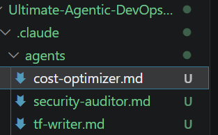
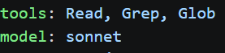
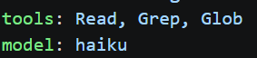
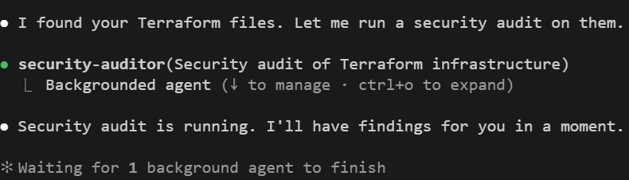
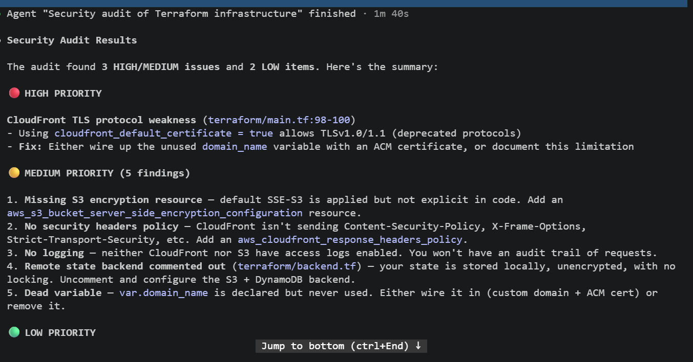
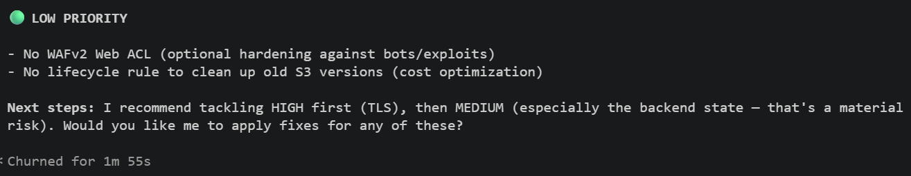

# Assignment 4 — Building Your AI Team

Part of the DevOps Micro Internship (DMI) Cohort 3 with Agentic AI

---

## Purpose

In this assignment, you will build and configure a set of specialized AI subagents inside your project. You will learn how different models and tool permissions define agent behavior, and you will trigger two real agent delegations to analyze security and cost aspects of your Terraform infrastructure.

---

# Task 1 — Create the Agents Folder and Add Files

## Goal

Create the `.claude/agents/` directory and add all required agent files.

### Evidence

#### Screenshot 1 — VS Code sidebar showing `.claude/agents/` with all 3 files

---

# Task 2 — Compare the Agent Configurations

## Goal

Analyze the configuration differences between the three agents and demonstrate understanding of model and tool selection.

### Written Answers

#### 1. Why does the cost optimizer use Haiku instead of Sonnet?

Task-Model Fit:
The cost optimizer uses Claude Haiku over Claude Sonnet because analyzing spending data and identifying patterns requires fast, high-volume processing of structured inputs rather than complex, deep reasoning.

Cost Efficiency: 
Haiku is Anthropic’s fastest and most affordable model, making it ideal for standard data-processing tasks where Sonnet’s higher cost and slower speed would be wasteful.

Core Design Principle: 
System design should match the model to the specific task complexity rather than defaulting to the most powerful option—using Haiku for cost optimization allows the tool to practice the very resource efficiency it preaches.

---

#### 2. Why does the security auditor NOT have Write in its tools list?

The Principle of Least Priviledge:
An auditor only needs to inspect and report—giving it write access creates unnecessary security risks if the agent is ever compromised.

Separates Duties:
Inspection and execution are kept separate. The auditor finds the issue, but a separate system (or human) must approve and apply the fix.

Prevents Prompt Injection Attacks: 
If an auditor reads malicious code or logs containing hidden instructions (like "delete this file"), having no write permissions ensures it cannot execute those destructive changes.

---

#### 3. Why does the tf-writer use `inherit` instead of a specific model?

Single Source of Truth: You can change the model globally in one central configuration file, and the tf-writer updates automatically without needing its own code changes.

Environment Flexibility: It allows the system to easily swap models based on where it's running (e.g., using a cheap/local model for testing, and a powerful model like GPT-4o for production).

Consistent Settings: It automatically pulls down API keys, token limits, and temperature settings from the parent workflow, keeping the code clean and preventing duplication.

In all, inherit keeps the architecture DRY (Don't Repeat Yourself) and decoupled. It lets tf-writer focus strictly on how to generate infrastructure-as-code, while leaving the decision of which engine to run on up to the main orchestrator.

---

### Evidence

#### Screenshot 2 — `security-auditor.md` frontmatter showing model and tools configuration

---

#### Screenshot 3 — `cost-optimizer.md` frontmatter showing the model and tools configuration

---

# Task 3 — Run the Security Auditor

## Goal

Trigger the security auditor agent and analyze the generated security report for your Terraform infrastructure.

### Evidence

#### Screenshot 4 — The delegation message showing Claude launched the security-auditor

---

#### Screenshot 5 — Security audit report output

---

# Task 4 — Run the Cost Optimizer

## Goal

Trigger the cost optimizer agent and review the generated cost optimization report.

### Evidence

#### Screenshot 6 — The full cost optimization report

[alt text](screenshots/04_06a.png).
[alt text](screenshots/04_06b.png)

---

# Submission Instructions

- Ensure all agent files are committed in `.claude/agents/`
- Complete all written answers in your GitHub Repo
- Push final changes to your forked GitHub repository

---

## GitHub Repository URL

`Add your URL here`

---

# Completion Checklist

- [ ] `.claude/agents/` folder contains all 3 agent files
- [ ] Screenshot 2 shows correct `security-auditor.md` configuration
- [ ] Screenshot 3 shows correct `cost-optimizer.md` configuration
- [ ] All 3 written answers completed 
- [ ] Security auditor executed successfully
- [ ] Cost optimizer executed successfully
- [ ] Security report is visible with findings
- [ ] Cost report is visible with recommendations
- [ ] All required screenshots added
- [ ] GitHub repo updated with agents

---

## 📌 About DMI & CloudAdvisory

DevOps Micro Internship (DMI) is a project-based DevOps program run by Pravin Mishra (The CloudAdvisory) focused on real-world execution, systems thinking, and career readiness.

It helps learners build strong DevOps foundations with hands-on experience.

---

## 📌 Resources

- 🌐 DMI Official Website: https://pravinmishra.com/dmi  
- 🎓 DevOps for Beginners (Udemy): https://www.udemy.com/course/devops-for-beginners-docker-k8s-cloud-cicd-4-projects/  
- 🎓 Agentic AI DevOps with Claude Code: https://www.udemy.com/course/ultimate-agentic-ai-devops-with-claude-code/  
- 🎓 DevOps with Claude Code: Terraform, EKS, ArgoCD & Helm: https://www.udemy.com/course/devops-with-claude-code-terraform-eks-argocd-helm/  
- ▶️ YouTube Playlist: https://www.youtube.com/playlist?list=PLFeSNDtI4Cho  
- 🔗 Pravin Mishra (LinkedIn): https://www.linkedin.com/in/pravin-mishra-aws-trainer/  
- 🏢 CloudAdvisory (LinkedIn): https://www.linkedin.com/company/thecloudadvisory/

---

*This submission is part of DevOps Micro Internship (DMI) Cohort 3 — Agentic AI Track.*