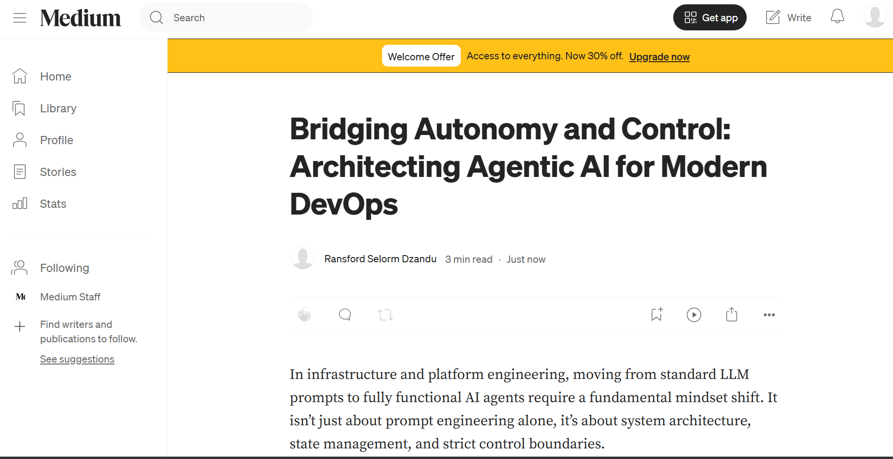
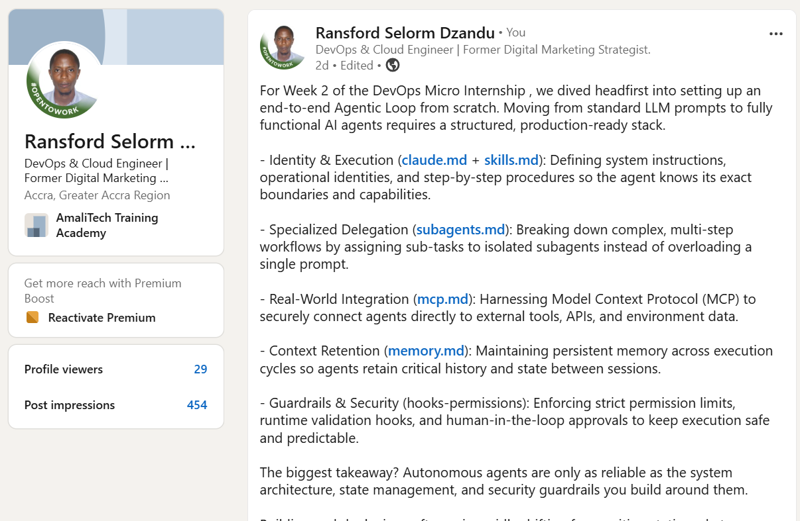

# Assignment 8 — Week 2 Reflection Blog

Part of the DevOps Micro Internship (DMI) Cohort 3 with Agentic AI

---

# Purpose

In this assignment, you will reflect on your Week 2 learning journey and write a short blog capturing your experience working with Agentic AI tools such as Claude Code, Skills, Subagents, MCP, Hooks, Permissions, and Memory.

You will also publish a LinkedIn post summarizing your learning and share both links for evaluation.

---

# Task 1 — Write Your Reflection Blog

## Goal

Write a reflection blog covering your Week 2 learning experience.

### Blog Requirements

Your blog must include:

* Title: **Reflection – Week 2**
* Minimum 300 words
* At least 2–3 topics from Week 2 (Claude Code, Skills, Subagents, MCP, Hooks, Permissions, Memory)
* Honest personal reflection (learning, challenges, mindset)
* One habit/system you plan to implement
* Your full name clearly visible

### Allowed Platforms

You can publish your blog on:

* Hashnode
* Medium
* Dev.to
* LinkedIn Article
* GitHub Markdown file
* Substack

---

### Evidence

#### Screenshot 1 — Blog published and visible

---

### Submission Field

Blog Link: 

https://medium.com/@selormransford9/bridging-autonomy-and-control-architecting-agentic-ai-for-modern-devops-682df21b6412

---

# Task 2 — Create LinkedIn Post

## Goal

Share your Week 2 learning publicly on LinkedIn.

---

### LinkedIn Post Requirements

Your post must include:

* One screenshot from any Week 2 assignment
* Short reflection (what you learned or built)
* Required P.S. line exactly as given below

---

### Required P.S. Line (Must Include Exactly)

> **P.S. This post is a part of DevOps Micro Internship with Agentic AI Cohort-3 by [Pravin Mishra](https://www.linkedin.com/in/pravin-mishra-aws-trainer/). You can start your DevOps journey by joining [DMI waiting list](https://forms.gle/3hvrWJBDzsDeJoPs6) (https://forms.gle/3hvrWJBDzsDeJoPs6).**

---

### Suggested Hashtags

#DMIByPravinMishra #AgenticAI #ClaudeCode #DevOps #LearningInPublic

---

### Evidence

#### Screenshot 2 — LinkedIn post published

---

### Submission Field

LinkedIn Post Content (copy-paste here):

For Week 2 of the DevOps Micro Internship , we dived headfirst into setting up an end-to-end Agentic Loop from scratch. Moving from standard LLM prompts to fully functional AI agents requires a structured, production-ready stack. 

- Identity & Execution (claude.md + skills.md): Defining system instructions, operational identities, and step-by-step procedures so the agent knows its exact boundaries and capabilities.

- Specialized Delegation (subagents.md): Breaking down complex, multi-step workflows by assigning sub-tasks to isolated subagents instead of overloading a single prompt.

- Real-World Integration (mcp.md): Harnessing Model Context Protocol (MCP) to securely connect agents directly to external tools, APIs, and environment data.

- Context Retention (memory.md): Maintaining persistent memory across execution cycles so agents retain critical history and state between sessions.

- Guardrails & Security (hooks-permissions): Enforcing strict permission limits, runtime validation hooks, and human-in-the-loop approvals to keep execution safe and predictable.

The biggest takeaway? Autonomous agents are only as reliable as the system architecture, state management, and security guardrails you build around them. 

Building and deploying software is rapidly shifting from writing static code to orchestrating intelligent, stateful agent loops and this is making the work of DevOps Engineers quite fascinating.

#DevOps_Engineering #Cloud_Engineering #DMI

𝗣.𝗦. 𝗧𝗵𝗶𝘀 𝗽𝗼𝘀𝘁 𝗶𝘀 𝗽𝗮𝗿𝘁 𝗼𝗳 𝘁𝗵𝗲 𝗗𝗲𝘃𝗢𝗽𝘀 𝗠𝗶𝗰𝗿𝗼 𝗜𝗻𝘁𝗲𝗿𝗻𝘀𝗵𝗶𝗽 𝘄𝗶𝘁𝗵 𝗔𝗴𝗲𝗻𝘁𝗶𝗰 𝗔𝗜 𝗖𝗼𝗵𝗼𝗿𝘁 𝟯 𝗯𝘆 𝗣𝗿𝗮𝘃𝗶𝗻 𝗠𝗶𝘀𝗵𝗿𝗮. 𝗜𝗳 𝘆𝗼𝘂'𝗿𝗲 𝗶𝗻𝘁𝗲𝗿𝗲𝘀𝘁𝗲𝗱 𝗶𝗻 𝘀𝘁𝗮𝗿𝘁𝗶𝗻𝗴 𝘆𝗼𝘂𝗿 𝗗𝗲𝘃𝗢𝗽𝘀 𝗷𝗼𝘂𝗿𝗻𝗲𝘆, 𝘆𝗼𝘂 𝗰𝗮𝗻 𝗷𝗼𝗶𝗻 𝘁𝗵𝗲 𝗗𝗠𝗜 𝘄𝗮𝗶𝘁𝗶𝗻𝗴 𝗹𝗶𝘀𝘁
🔗 https://lnkd.in/emBScRTA

View image

---

### LinkedIn Post Link:

https://www.linkedin.com/posts/ransfordselormdzandu_devopsabrengineering-cloudabrengineering-share-7485761423609020416-yQHJ/?utm_source=share&utm_medium=member_desktop&rcm=ACoAAEwl7_QBxhr73Ja5tGLqw7xByGHiHbrAk08

---

# Submission Instructions

* Blog must be publicly accessible
* LinkedIn post must be visible (public or unlisted where applicable)
* All required fields must be filled
* Screenshot proofs must be added to GitHub repository
* Do not include sensitive information in blog or post

---

# Completion Checklist

* [ ] Blog written with required structure
* [ ] Blog includes at least 2–3 Week 2 topics
* [ ] Blog is publicly accessible
* [ ] LinkedIn post created
* [ ] Required P.S. line included
* [ ] LinkedIn post content copied in submission field
* [ ] Blog link added
* [ ] LinkedIn post link added
* [ ] Screenshots added to GitHub repo

---

# About DMI & CloudAdvisory

DevOps Micro Internship (DMI) is a project-based DevOps program run by Pravin Mishra (The CloudAdvisory), focused on real-world execution, systems thinking, and agentic AI workflows.

It helps learners build strong DevOps foundations through hands-on experience.

---

# Resources

* 🌐 DMI Official Website: [https://pravinmishra.com/dmi](https://pravinmishra.com/dmi)
* 🎓 DevOps for Beginners (Udemy): [https://www.udemy.com/course/devops-for-beginners-docker-k8s-cloud-cicd-4-projects/](https://www.udemy.com/course/devops-for-beginners-docker-k8s-cloud-cicd-4-projects/)
* 🎓 Agentic AI DevOps with Claude Code: [https://www.udemy.com/course/ultimate-agentic-ai-devops-with-claude-code/](https://www.udemy.com/course/ultimate-agentic-ai-devops-with-claude-code/)
* 🎓 DevOps with Claude Code: Terraform, EKS, ArgoCD & Helm: [https://www.udemy.com/course/devops-with-claude-code-terraform-eks-argocd-helm/](https://www.udemy.com/course/devops-with-claude-code-terraform-eks-argocd-helm/)
* ▶️ YouTube Playlist: [https://www.youtube.com/playlist?list=PLFeSNDtI4Cho](https://www.youtube.com/playlist?list=PLFeSNDtI4Cho)
* 🔗 Pravin Mishra (LinkedIn): [https://www.linkedin.com/in/pravin-mishra-aws-trainer/](https://www.linkedin.com/in/pravin-mishra-aws-trainer/)
* 🏢 CloudAdvisory (LinkedIn): [https://www.linkedin.com/company/thecloudadvisory/](https://www.linkedin.com/company/thecloudadvisory/)

