# Assignment 3 — Production Maintenance Drill (OPS Checklist)

Part of the DevOps Micro Internship (DMI) Cohort 3 with Agentic AI

---

## Purpose

In this assignment, you will treat your already deployed React application (on Ubuntu VM with Nginx) as a live production system. You will perform structured operational checks covering network validation, service health, log analysis, resource monitoring, configuration verification, and incident simulation with recovery — mirroring real on-call DevOps responsibilities.

---

# Task 1 — Server Access & Networking Validation

## Goal

Verify that the deployed React application is reachable from the browser and confirm basic network connectivity of the Ubuntu VM.

### Evidence

#### Screenshot 1 — Browser showing the React app with your Full Name visible on the UI

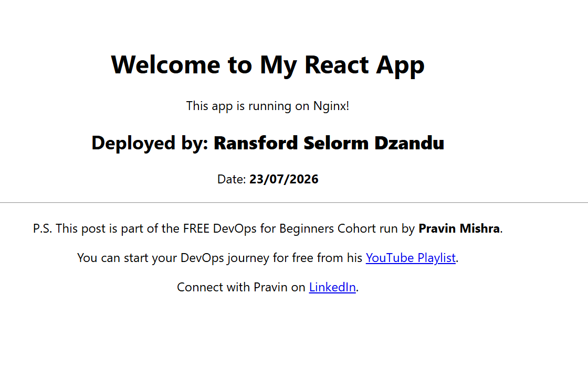

---

#### Screenshot 2 — Output of `ip a`

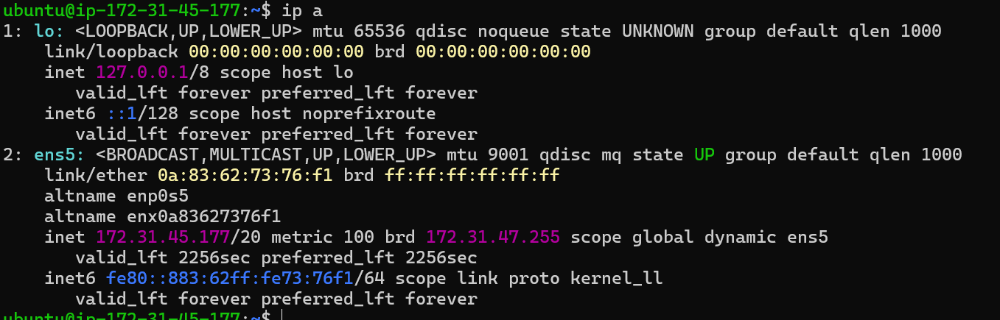

---

#### Screenshot 3 — Output of `sudo ss -tulpen`

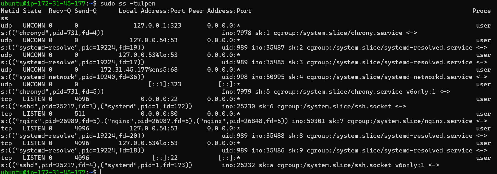

---

#### Screenshot 4 — Output of `sudo ufw status`

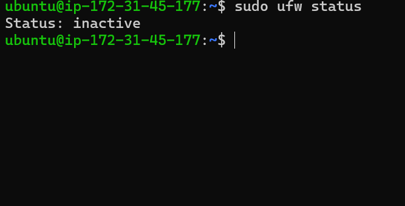

---

### Notes

Answer the following in your own words:

**1. What proves Nginx is listening on 0.0.0.0:80?**

Its because the website is working in the browser. Nginx has been configured to listen on port 80. that is when we run sudo systemctl status nginx, it shows running..

---

**2. What proves SSH is active on port 22?**

SSH is active on port 22 because we have been able to shh into our ec2 instance and running commands in our local machine.

---

**3. Did you find any unexpected open ports? Explain briefly.**

No, i have only configured my ports to port 22 and port 80

---

# Task 2 — Service Health & Systemd Validation (Nginx)

## Goal

Verify that Nginx is properly installed, running, enabled at boot, and safely configured.

### Evidence

#### Screenshot 1 — Output of `systemctl status nginx --no-pager`

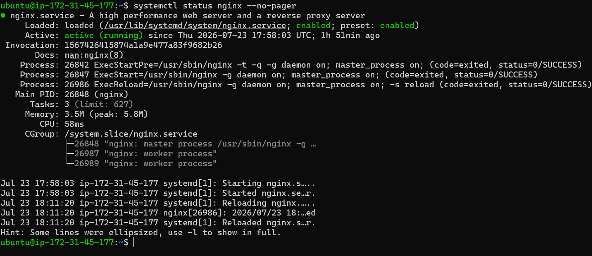

---

#### Screenshot 2 — Output of `sudo nginx -t`

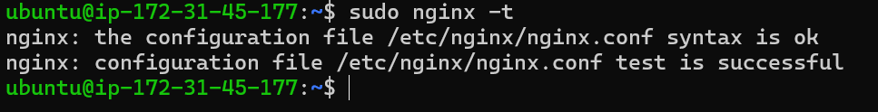

---

#### Screenshot 3 — Output of `sudo ss -lptn '( sport = :80 )'`

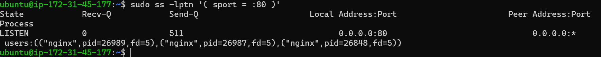

---

### Notes

Answer the following in your own words:

**1. What happens if Nginx fails to restart in production?**

The website will got down, users will get connection errors like 502 bad Gateway leading to revenue loss for the company who hosted the website.

---

**2. What's your basic rollback plan?**

step 1, I will check what failed by running	sudo systemctl status nginx
step 2, i will find the error by running sudo journalctl -u nginx
step 3 i will revert to last working config running	sudo cp nginx.conf.backup nginx.conf in my instance's terminal.
step 4, I will verify whether the backup is valid by running sudo nginx -t
step 5 i will apply restored config by running sudo systemctl reload nginx
lastly, i will verify and confirm site is back up by running curl http://localhost:80 in my terminal.

---

# Task 3 — Logs & Request Trace

## Goal

Verify real traffic flow and analyze logs to understand system behavior and errors.

### Evidence

#### Screenshot 1 — Output of `sudo tail -n 30 /var/log/nginx/access.log`

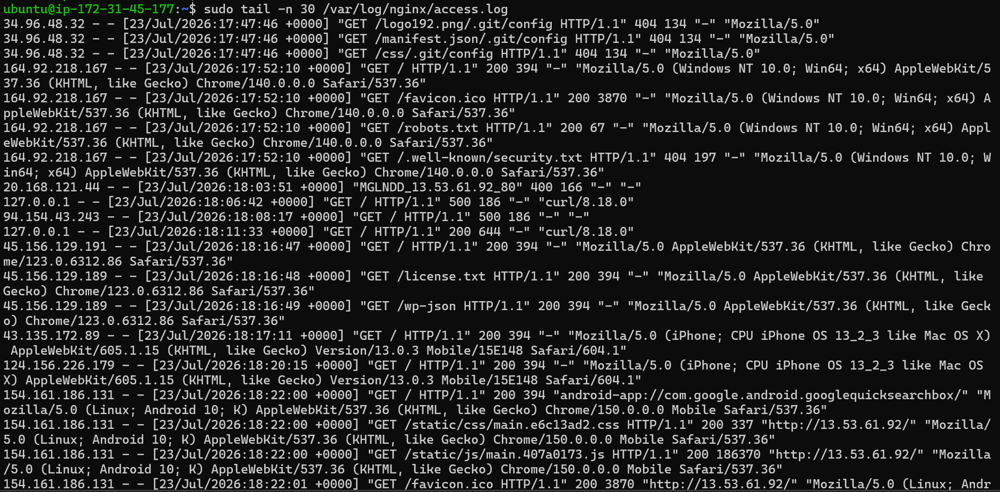

---

#### Screenshot 2 — Output of `sudo tail -n 30 /var/log/nginx/error.log`

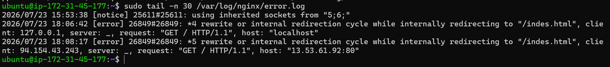

---

#### Screenshot 3 — Output of `sudo journalctl -u nginx --no-pager -n 50`

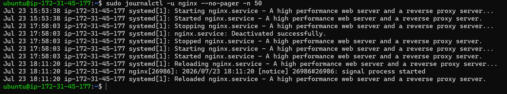

---

### Notes

Answer the following in your own words:

**1. Were there any errors in the logs?**

- If yes, mention 1–2 example error lines from the logs and explain what each one means in simple terms.
- If no, explain what it means if the error log is empty or shows no recent errors during your check.

No, the output did not show any errors in the logs.

---

**2. If there were no errors, what does that indicate about the system?**

No, the output did not show any errors in the log. the only error it showed was a spelling error. indes.html instead of index.html. The system is fully up and active

---

**3. Based on the access logs, were your curl requests visible in the log entries? What does that prove about traffic flow?**

Yes. 

---

# Task 4 — System Resource Health Check (Capacity Red Flags)

## Goal

Assess server capacity and detect potential performance or failure risks.

### Evidence

#### Screenshot 1 — Output of `uptime`

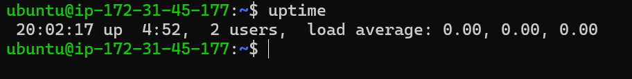

---

#### Screenshot 2 — Output of `free -h`

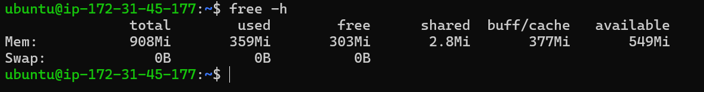

---

#### Screenshot 3 — Output of `df -h`

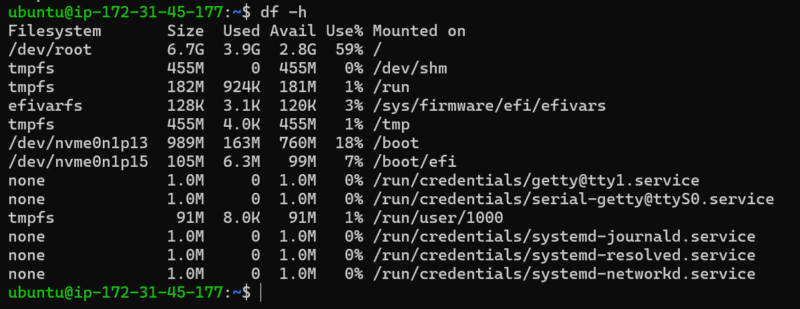

---

#### Screenshot 4 — Output of `sudo du -sh /var/* | sort -h`

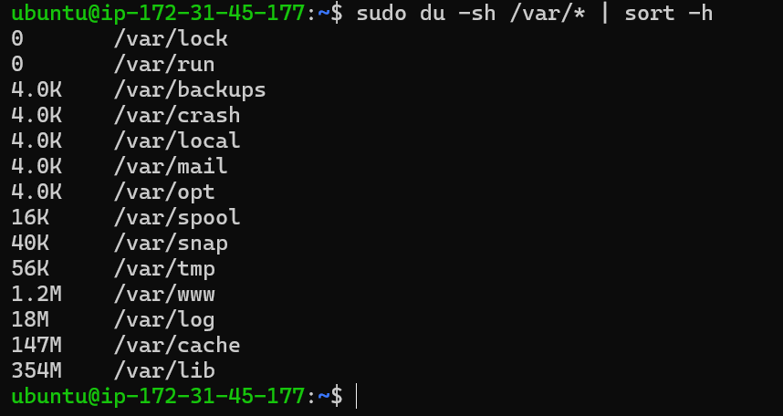

---

### Notes

Answer the following in your own words:

**1. Which resource looks most critical right now? (CPU/load, memory, or disk) Explain why.**

the disk space looks critical because it is above 50% full

---

**2. What happens if disk becomes 100% full in a production server?**

Service Crashes: the Web apps, APIs, and background tasks will fail because they can't write temporary files or process requests.

Database Corruption: Incomplete writes to database transaction logs can corrupt data and mess business operations

Broken Logging: Due to the overload on the disk,System and web server logs will stop recording, leaving you blind to traffic and system errors.

SSH Lockouts: You can lose the ability to log in remotely because Linux can't write session lock files.

---

# Task 5 — Configuration & Deployment Verification

## Goal

Ensure the correct React build is deployed and Nginx is serving it properly.

### Evidence

#### Screenshot 1 — Output of `ls -lah /var/www/html | head -n 20`

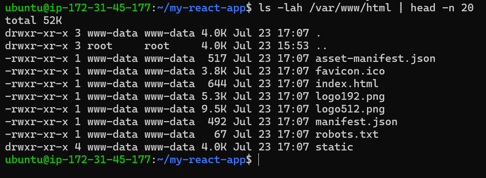

---

#### Screenshot 2 — Output of `grep -R "Deployed by" -n /var/www/html 2>/dev/null | head`

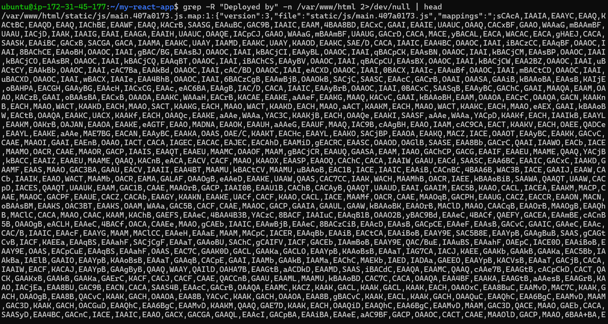

---

#### Screenshot 3 — Output of `grep -n "try_files" /etc/nginx/sites-available/default`

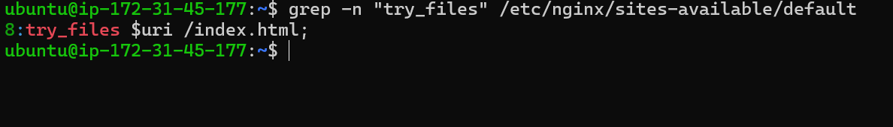

---

### Notes

Answer the following in your own words:

**1. How do you confirm that the correct version of the application is deployed?**

They are several ways to do that.
1. Checking live application response curl -I https://<public ip adress>
2. Checking web server and service status by running sudo systemctl status nginx and sudo nginx -t

---

# Task 6 — Nginx Configuration Failure Simulation

## Goal

Simulate a real-world Nginx misconfiguration and recover the service safely.

### Evidence

#### Screenshot 1 — Output of `sudo nginx -t` showing the syntax error (broken config)

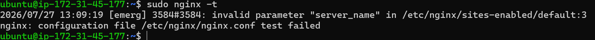

---

#### Screenshot 2 — Output of `sudo nginx -t` showing syntax ok (fixed config)

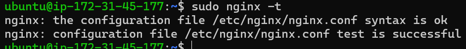

---

#### Screenshot 3 — Output of `curl -I http://<public-ip>` confirming recovery (200 OK)

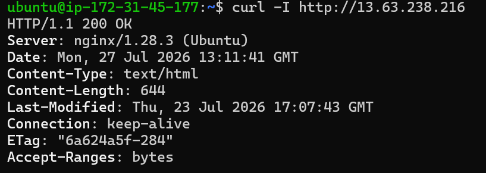

---

### Notes

Answer the following in your own words:

**1. What caused the configuration failure?**

There was a disruption in the configuration code/file. we changed something in the file that gave us a 500

---

**2. How did you fix the issue?**

I fixed the issue by correcting the error in the code/file. when i run sudo nginx -t again, it worked.

---

**3. How can you avoid this kind of issue in real production systems?**

Always checking the code before deploying. sometimes those basic codes/files can be handed to claude to check for errors and to give recommendations for corrections that are needed

---

# Task 7 — Web Application Failure Simulation

## Goal

Simulate missing deployment content and recover the application safely.

### Evidence

#### Screenshot 1 — Output of `curl -I http://<public-ip>` showing failure (non-200 response)

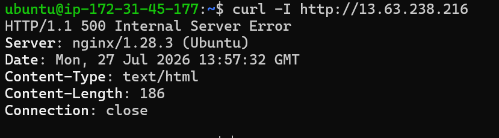

---

#### Screenshot 2 — Output of `curl -I http://<public-ip>` confirming recovery (200 OK)

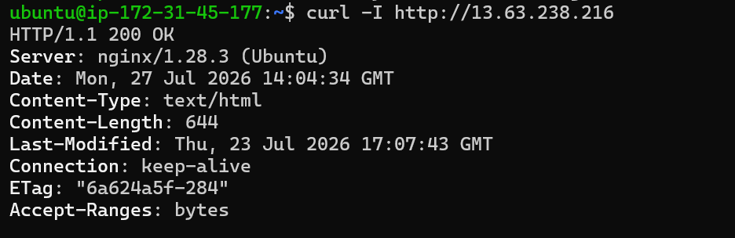

---

### Notes

Answer the following in your own words:

**1. What caused the application to break in this scenario?**

Error code 

---

**2. How did you fix the issue and restore the application?**

correcting the code in the file / error

---

**3. What steps would you take to prevent this kind of issue in real production systems?**

Always checking for and correcting errors before deploying.
---

# Task 8 — Security & Reliability Review

## Goal

Review and reflect on the security and reliability practices applied during this assignment.

### Security & Reliability Notes

Answer the following in your own words:

**1. Why is SSH key-based authentication more secure than sharing passwords?**

1. Brute-Force Proof: SSH keys (4096-bit RSA and Ed25519) are mathematically impossible for hackers to guess or crack using automated tools.

2. Zero Transmission Risk: MY private key never leaves my local computer, also the server tests my identity using standard cryptography without ever seeing my key.

3. Phishing & Interception Protection: Unlike passwords, an attacker monitoring the network or setting up a fake server cannot steal my credentials during login.

4. Eliminates Weak Passwords: It removes human error, such as setting short passwords or reusing the same password across multiple servers.

---

**2. Why should only required ports be open on a production server?**

1. Smaller Attack Surface: Every open port runs a service that could have unpatched security flaws. Fewer open ports mean fewer ways for hackers to get in.

2. Protects Sensitive Services: Keeping ports for databases (like MySQL on 3306 or Redis on 6379) closed to the internet stops automated brute-force and data leaks.

---

**3. Why is it important for Nginx to be enabled on boot?**

Automatic Disaster Recovery: If a cloud instance reboots due to a cloud provider outage, kernel panic, system update, or power failure, Nginx will start up immediately as soon as the operating system finishes loading.

Minimizes Downtime: Without auto-start enabled, your site stays down until an engineer notices the failure, SSHs into the server, and manually runs sudo systemctl start nginx.

Reliability for Unattended Services: In a modern cloud setup, servers are meant to be self-healing. Enabling Nginx ensures your web tier abides by that "hands-off" reliability standard.

---

**4. What are the risks of sharing secrets, keys, or credentials publicly?**

Instant Bot Scrapes: Scrapers detect exposed keys on public GitHub repos within seconds.

Huge Cloud Bills: Attackers use stolen AWS/Cloud keys to spin up expensive servers for crypto mining, costing thousands in hours.

Full System Breaches: Leaked SSH keys or database credentials give attackers full control to steal, delete, or hold your data for ransom.

Account Hijacking: Stolen API tokens (e.g., SendGrid, NPM) let bad actors send spam under your domain or inject malware into your software packages.

Legal Penalties: Exposing access credentials can lead to severe fines and regulatory violations under data privacy laws (like GDPR or PCI-DSS).

---

**5. Why should cloud resources be stopped or terminated when they are no longer needed?**

1. To stop the payment for cloud resources that are not in use.
2. For the sake of environmental sustainability, it is very prudent and wise to stop and terminate the cloud resources when they are not in use. This will help reduce the use of water and energy which are crucial elements used by Cloud Service Providers

---

# LinkedIn Post (Required)

## Evidence

#### LinkedIn Post URL

Paste your LinkedIn post URL here:

https://www.linkedin.com/posts/ransfordselormdzandu_for-week-3-in-the-devops-micro-internship-share-7487554381568020480-3q8u/?utm_source=share&utm_medium=member_desktop&rcm=ACoAAEwl7_QBxhr73Ja5tGLqw7xByGHiHbrAk08

---

#### Screenshot — Published LinkedIn post

![LInkedIn Ss]](<screenshots/LinkedIn Screenshot.png>)

---

# Submission Instructions

- Add all required screenshots in your submission
- Full name must be visible in required screenshots
- Do not expose sensitive information (keys, passwords, account IDs)

---

# Completion Checklist

- [ ] Task 1: Screenshots (browser, ip a, ss -tulpen, ufw status) + Notes answered
- [ ] Task 2: Screenshots (nginx status, nginx -t, ss port 80) + Notes answered
- [ ] Task 3: Screenshots (access log, error log, journalctl) + Notes answered
- [ ] Task 4: Screenshots (uptime, free -h, df -h, du -sh) + Notes answered
- [ ] Task 5: Screenshots (ls html, grep deployed by, grep try_files) + Notes answered
- [ ] Task 6: Screenshots (nginx -t fail, nginx -t pass, curl recovery) + Notes answered
- [ ] Task 7: Screenshots (curl failure, curl recovery) + Notes answered
- [ ] Task 8: Security & Reliability Notes answered
- [ ] LinkedIn post published and URL submitted
- [ ] Full Name visible in all required screenshots
- [ ] No sensitive data exposed

---

## 📌 About DMI & CloudAdvisory

DevOps Micro Internship (DMI) is a project-based DevOps program run by Pravin Mishra (The CloudAdvisory) focused on real-world execution, systems thinking, and career readiness.

It helps learners build strong DevOps foundations with hands-on experience.

---

## 📌 Resources

- 🌐 DMI Official Website: https://pravinmishra.com/dmi  
- 🎓 DevOps for Beginners (Udemy): https://www.udemy.com/course/devops-for-beginners-docker-k8s-cloud-cicd-4-projects/  
- 🎓 Agentic AI DevOps with Claude Code: https://www.udemy.com/course/ultimate-agentic-ai-devops-with-claude-code/  
- 🎓 DevOps with Claude Code: Terraform, EKS, ArgoCD & Helm: https://www.udemy.com/course/devops-with-claude-code-terraform-eks-argocd-helm/  
- ▶️ YouTube Playlist: https://www.youtube.com/playlist?list=PLFeSNDtI4Cho  
- 🔗 Pravin Mishra (LinkedIn): https://www.linkedin.com/in/pravin-mishra-aws-trainer/  
- 🏢 CloudAdvisory (LinkedIn): https://www.linkedin.com/company/thecloudadvisory/

---

*This submission is part of DevOps Micro Internship (DMI) Cohort 3 — Agentic AI Track.*