# Assignment 5 — Bash Script Automation Drill (OPS Checklist)

Part of the DevOps Micro Internship (DMI) Cohort 3 with Agentic AI

---

## Purpose

In this assignment, you will practice Bash scripting by building a series of small automation scripts covering environment setup, variables, arrays, loops, file conditionals, if-else logic, and functions. These scripts form the foundation of real-world Linux automation used in DevOps, cloud, and production support environments.

---

# Task 1 — Bash Environment & Workspace Setup

## Goal

Verify that Bash is available on your system and create a clean workspace for this assignment.

### Evidence

#### Screenshot 1 — Output of `echo $SHELL` and `bash --version`

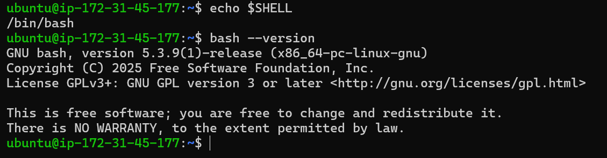

---

#### Screenshot 2 — Output of `pwd` and `ls -lah` showing the scripts directory

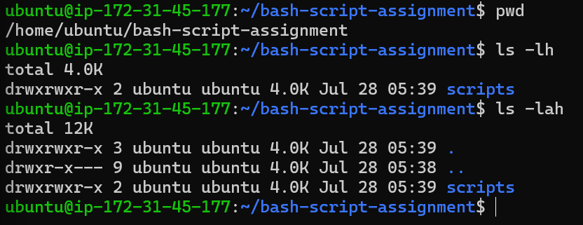

---

### Notes

Answer the following in your own words:

**1. What is Bash?**

Bash is a terminal interface and scripting language for Linux/macOS that executes commands and automates tasks line-by-line.

---

**2. What is the difference between shell and Bash?**

Shell is any program that provides a user interface to interact with an operating system by executing commands. it includes many different variations and languages, such as sh (Bourne shell), zsh (Z shell), csh (C shell), fish, and even graphical interfaces (GUI shells).
It is anso a strict, basic standard meant to run identically across almost any Unix-like system, but lacks advanced features.

Bash (Bourne Again SHell) is a specific, widely-used implementation of a Unix shell created as an upgraded replacement for the original Bourne shell (sh).It is a single, concrete shell program with its own unique syntax extensions, features, and built-in commands. Bash adds user-friendly interactive features (command history, autocompletion) and expanded scripting capabilities (arrays, enhanced string operations, extended conditionals like [[ ]]).

---

**3. Why is it important to confirm the Bash version before writing scripts?**

Confirming your Bash version ensures your script runs reliably without throwing syntax errors or breaking on different systems. It helps with security issues too because older versions always come with bug fixing issues.

---

# Task 2 — Your First Bash Script

## Goal

Create your first Bash script, make it executable, and run it from the terminal.

### Evidence

#### Screenshot 1 — Content of `first-script.sh`

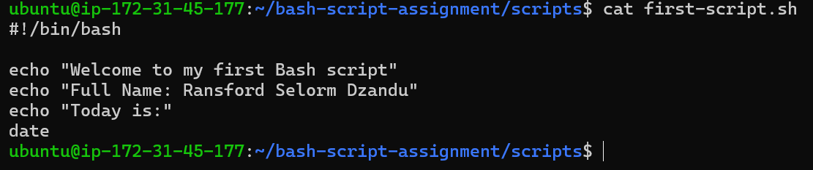

---

#### Screenshot 2 — Output of `./first-script.sh`

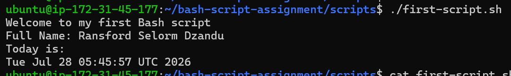

---

#### Screenshot 3 — Output of `ls -l first-script.sh` showing executable permission

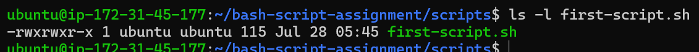

---

### Notes

Answer the following in your own words:

**1. What is the purpose of `#!/bin/bash`?**

#!/bin/bash which is called a shebang tells the operating system which program to use to execute the script.
It specifies the Interpreter because it explicitly directs the system to pass the file's contents to the Bash program located at /bin/bash. Without it, the system defaults to whatever shell the current user happens to be using (like sh or zsh), which can cause your script to fail if it relies on Bash-specific syntax.
It also lets you run the file directly as an executable command (e.g., ./script.sh) instead of having to explicitly type bash script.sh.

---

**2. Why do we use `chmod +x` before running a script?**

chmod +x grants executable permission to a file so the operating system allows a user to run it directly as a command. Unix-like systems (Linux/macOS) block newly created files from executing to prevent rogue or downloaded scripts from running unexpectedly.alos, it lets a user run the script directly from thier terminal using ./script.sh instead of having to type bash script.sh. It works in tandem with #!/bin/bash—the system checks if the file has +x permission first, then reads the shebang line to launch the correct interpreter automatically.

---

**3. What is the difference between running a script using `./script.sh` and `bash script.sh`?**

./script.sh relies on the file's own permissions and shebang line, while bash script.sh bypasses executable permissions and forces the file to run directly through Bash.

---

# Task 3 — Variables: User Information Script

## Goal

Use variables to store and display user-related information.

### Evidence

#### Screenshot 1 — Content of `user-info.sh`

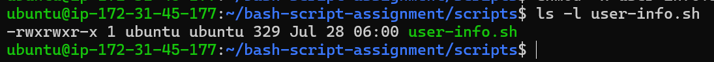

---

#### Screenshot 2 — Output of `./user-info.sh`

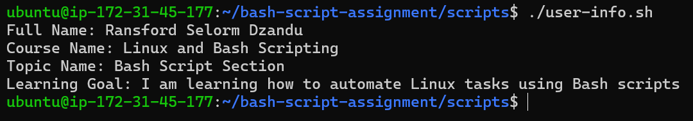

---

### Notes

Answer the following in your own words:

**1. What is a variable in Bash?**

A variable in Bash is a named container used to store data such as text strings, numbers, or file paths—that you can reuse and manipulate throughout a script.

---

**2. Why should we avoid spaces around the `=` sign when creating variables?**

We must avoid spaces around the = sign because Bash parses space-separated words as separate commands and arguments

---

**3. How do you access the value stored inside a Bash variable?**

You access the value stored inside a Bash variable by prefixing its name with a dollar sign ($).

---

# Task 4 — Arrays & Loops: Tools Checklist Script

## Goal

Use arrays and loops to print a checklist of tools used in Bash scripting.

### Evidence

#### Screenshot 1 — Content of `tools-checklist.sh`

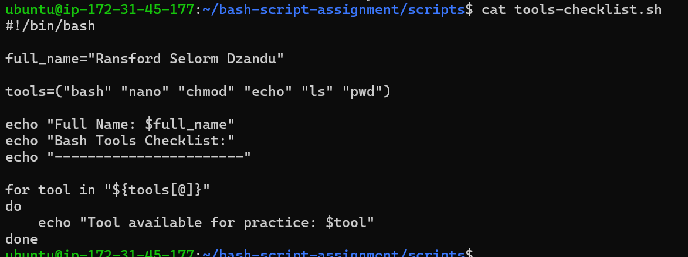

---

#### Screenshot 2 — Output of `./tools-checklist.sh`

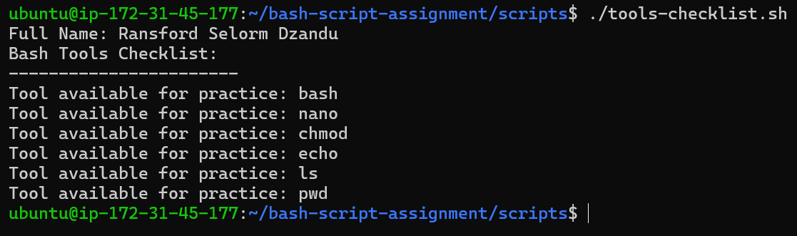

---

### Notes

Answer the following in your own words:

**1. What is an array in Bash?**

An array in Bash is a data structure that allows you to store multiple values under a single variable name.

---

**2. Why are arrays useful in scripts?**

Arrays are useful because they allow you to manage and process collections of related data dynamically without writing repetitive code.

Instead of creating dozens of separate variables to hold individual items, an array lets you group them under a single name and loop through them automatically.

---

**3. What does `"${tools[@]}"` mean?**

"${tools[@]}" expands to every single item in the tools array, keeping each item safely intact as an individual word.

---

**4. What is the purpose of the `for` loop in this script?**

The for loop automates repetitive tasks by iterating through a collection of items (like an array or a list of files) and running the same block of code once for every single item.

---

# Task 5 — Loops: Number Counter Script

## Goal

Use loops to repeat a task multiple times.

### Evidence

#### Screenshot 1 — Content of `counter.sh`

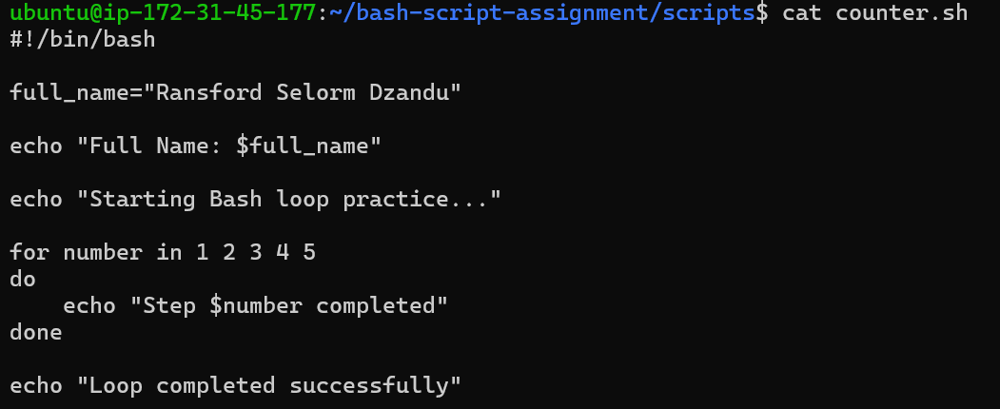

---

#### Screenshot 2 — Output of `./counter.sh`

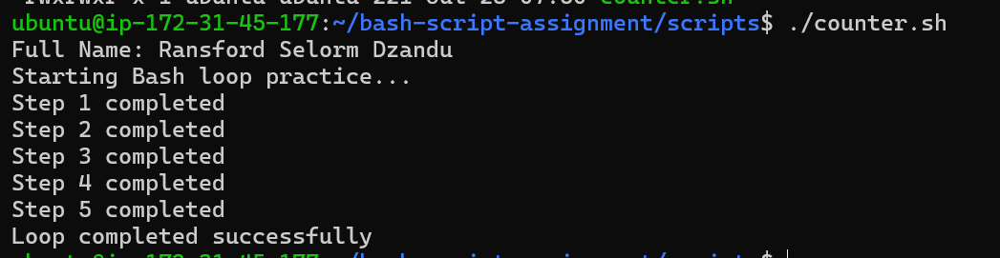

---

### Notes

Answer the following in your own words:

**1. What is a loop?**

A loop is a programming control structure that automatically repeats a block of code multiple times until a specific condition is met.

---

**2. Why do we use loops in Bash scripting?**

A loop is a programming control structure that automatically repeats a block of code multiple times until a specific condition is met.

---

**3. How many times did the loop run in your script?**

5

---

**4. What would you change if you wanted the loop to run 10 times?**

i will extend the number from 5 to 10

---

# Task 6 — Files & Conditionals: File Validation Script

## Goal

Use file checks and conditionals to verify whether files and directories exist.

### Evidence

#### Screenshot 1 — Output of `ls -lah ../test-folder`

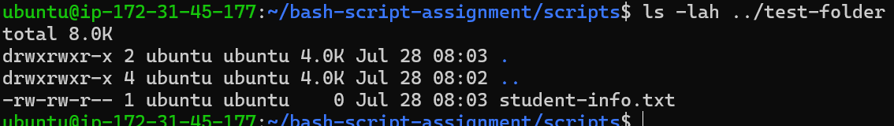

---

#### Screenshot 2 — Content of `file-check.sh`

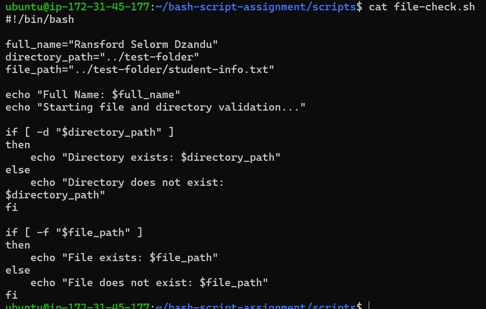

---

#### Screenshot 3 — Output of `./file-check.sh`

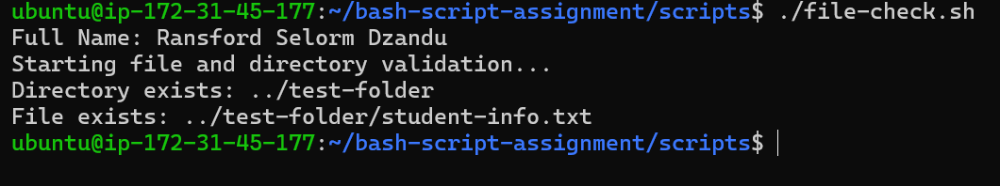

---

### Notes

Answer the following in your own words:

**1. What does `-d` check in Bash?**

In Bash, the -d conditional operator checks whether a given path exists and is a directory.

---

**2. What does `-f` check in Bash?**

In Bash, the -f conditional operator checks whether a given path exists and is a regular file.

---

**3. Why should file and directory paths be stored in variables?**

Storing file and directory paths in variables makes your scripts maintainable, less prone to typos, and easily adaptable across different environments.

---

**4. What happens if the file does not exist?**

If a script tries to process a file that doesn't exist, the exact outcome depends on whether you checked for its existence first.

---

# Task 7 — Conditionals: Pass or Retry Script

## Goal

Use if-else conditionals to make decisions based on a variable value.

### Evidence

#### Screenshot 1 — Content of `score-check.sh` with `score=85`

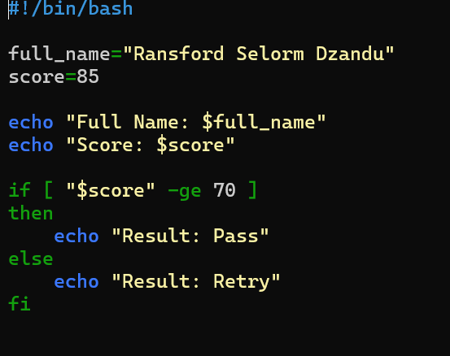

---

#### Screenshot 2 — Output showing `Result: Pass`

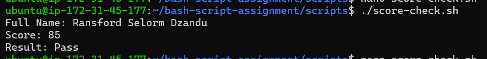

---

#### Screenshot 3 — Content of `score-check.sh` with `score=55`

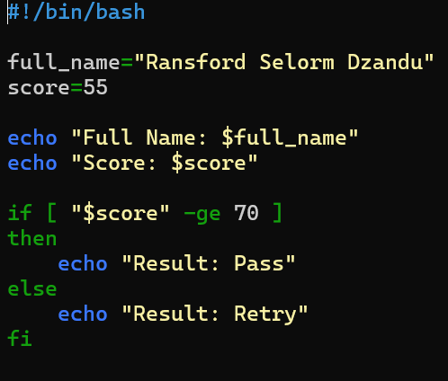

---

#### Screenshot 4 — Output showing `Result: Retry`

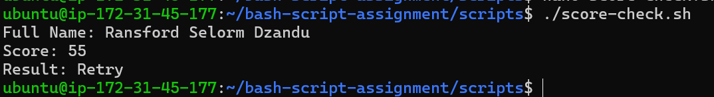

---

### Notes

Answer the following in your own words:

**1. What is the purpose of if-else in Bash?**

The purpose of if-else in Bash is to make decisions and control the flow of execution based on whether a specific condition is true or false.

---

**2. What does `-ge` mean?**

In Bash, the -ge operator stands for "Greater than or Equal to" and is used to perform numeric comparisons inside conditional tests.

---

**3. Why should conditions be tested with different values?**

You should test conditions with different values to verify that every path in your code works as expected and to catch edge-case bugs before they break in production.

When you write an if-elif-else block, you are creating multiple branch paths in your program. If you only test one input value, you've only verified a fraction of your code.

---

**4. How can conditionals help in automation scripts?**

Conditionals make automation scripts smart, transforming them from dumb lists of steps into resilient programs that can make real-time decisions, recover from errors, and adapt to different environments.

Without conditionals, an automated script blindly runs line 1, line 2, line 3, regardless of what happens on the system. If line 1 fails, line 2 runs anyway and often breaks everything down the line.

---

# Task 8 — Functions: Final Bash Automation Script

## Goal

Create a final Bash script using functions to organize reusable code.

### Evidence

#### Screenshot 1 — Content of `final-automation.sh`

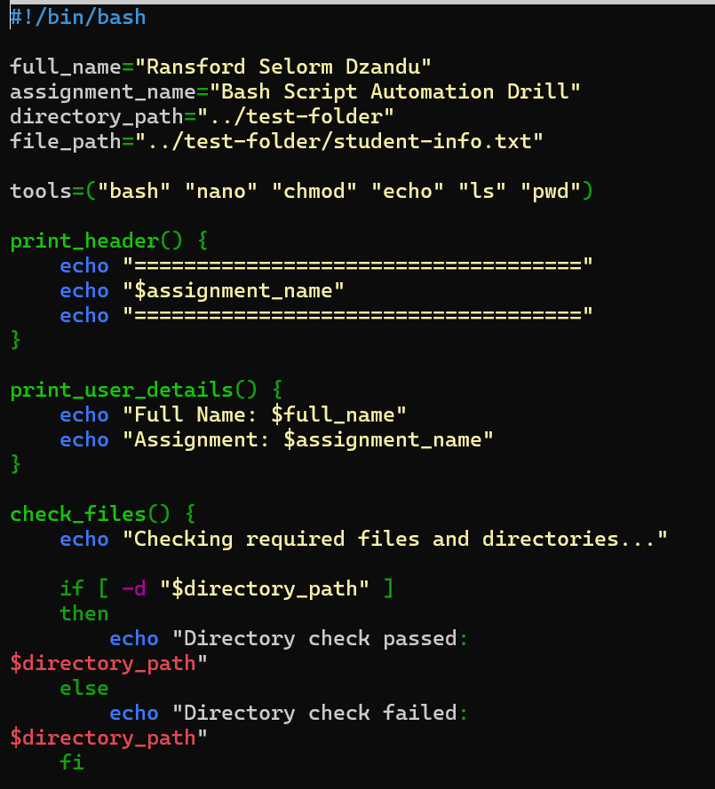

---

#### Screenshot 2 — Output of `./final-automation.sh`

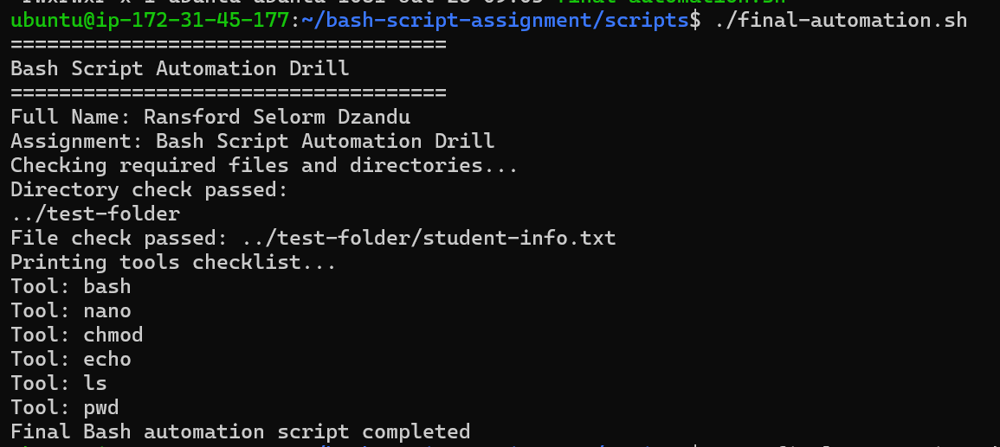

---

#### Screenshot 3 — Output of `ls -lah` showing all created scripts

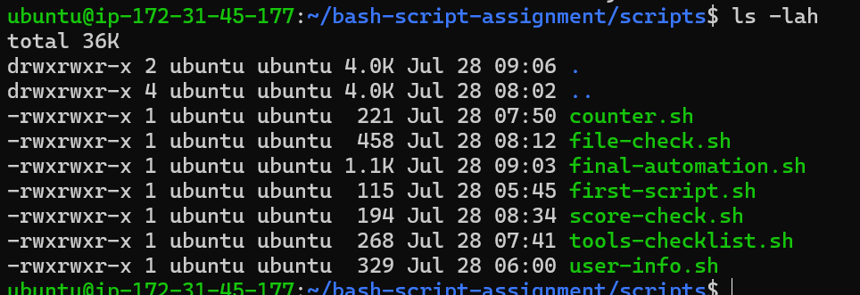

---

### Notes

Answer the following in your own words:

**1. What is a function in Bash?**

A function in Bash is a named block of code that groups multiple commands together into a single, reusable unit.

Instead of rewriting the same set of commands throughout a script, you define the logic once in a function and run it whenever needed simply by calling its name.

---

**2. Why are functions useful in scripts?**

Functions are useful in scripts because they make code modular, reusable, readable, and easy to maintain.

Instead of copy-pasting code or letting a script turn into an unorganized, hundreds-of-lines wall of text, functions allow you to structure your script into clean, logical building blocks.

---

**3. Which functions did you create in this script?**

4 functions
- print_header prints the assignment
- print_user_details prints my full name and the assignment
- check_files checks whether the required directory and file exist
- print_tools uses a loop to print each tool stored in the array.

---

**4. How does this final script combine variables, arrays, loops, conditionals, files, and functions?**

The script uses variables to store my name, the assignment name, and the required paths. it uses an array to store the tool names and a loop to print them one by one.
It uses the if-else conditionals with -d and -f to check the required directory and file. Finally, the related commands are organized into functions, and those functions are called in the correct order to run the complete automation script.
---

# LinkedIn Post (Required)

## Evidence

#### LinkedIn Post URL

Paste your LinkedIn post URL here:

'https://www.linkedin.com/posts/ransfordselormdzandu_for-week-3-in-the-devops-micro-internship-share-7487554381568020480-3q8u/?utm_source=share&utm_medium=member_desktop&rcm=ACoAAEwl7_QBxhr73Ja5tGLqw7xByGHiHbrAk08'

---

#### Screenshot — Published LinkedIn post

---

# Submission Instructions

- Add all required screenshots in your submission
- Full name must be visible in required screenshots
- All script files must be created and run successfully
- Required notes must be answered clearly for every task
- Do not expose sensitive information (keys, passwords, credentials)

---

# Completion Checklist

- [ ] Task 1: Environment setup verified, workspace created (Screenshots 1–2, Notes answered)
- [ ] Task 2: First script created, executed, permissions verified (Screenshots 1–3, Notes answered)
- [ ] Task 3: Variables script created and run (Screenshots 1–2, Notes answered)
- [ ] Task 4: Arrays and loops script created and run (Screenshots 1–2, Notes answered)
- [ ] Task 5: Counter loop script created and run (Screenshots 1–2, Notes answered)
- [ ] Task 6: File validation script created and run (Screenshots 1–3, Notes answered)
- [ ] Task 7: Pass/Retry conditional script tested with both values (Screenshots 1–4, Notes answered)
- [ ] Task 8: Final automation script created and run (Screenshots 1–3, Notes answered)
- [ ] All scripts run without errors
- [ ] Full Name visible in all required screenshots
- [ ] LinkedIn post published and URL submitted
- [ ] No sensitive data exposed

---

## 📌 About DMI & CloudAdvisory

DevOps Micro Internship (DMI) is a project-based DevOps program run by Pravin Mishra (The CloudAdvisory) focused on real-world execution, systems thinking, and career readiness.

It helps learners build strong DevOps foundations with hands-on experience.

---

## 📌 Resources

- 🌐 DMI Official Website: https://pravinmishra.com/dmi  
- 🎓 DevOps for Beginners (Udemy): https://www.udemy.com/course/devops-for-beginners-docker-k8s-cloud-cicd-4-projects/  
- 🎓 Agentic AI DevOps with Claude Code: https://www.udemy.com/course/ultimate-agentic-ai-devops-with-claude-code/  
- 🎓 DevOps with Claude Code: Terraform, EKS, ArgoCD & Helm: https://www.udemy.com/course/devops-with-claude-code-terraform-eks-argocd-helm/  
- ▶️ YouTube Playlist: https://www.youtube.com/playlist?list=PLFeSNDtI4Cho  
- 🔗 Pravin Mishra (LinkedIn): https://www.linkedin.com/in/pravin-mishra-aws-trainer/  
- 🏢 CloudAdvisory (LinkedIn): https://www.linkedin.com/company/thecloudadvisory/

---

*This submission is part of DevOps Micro Internship (DMI) Cohort 3 — Agentic AI Track.*