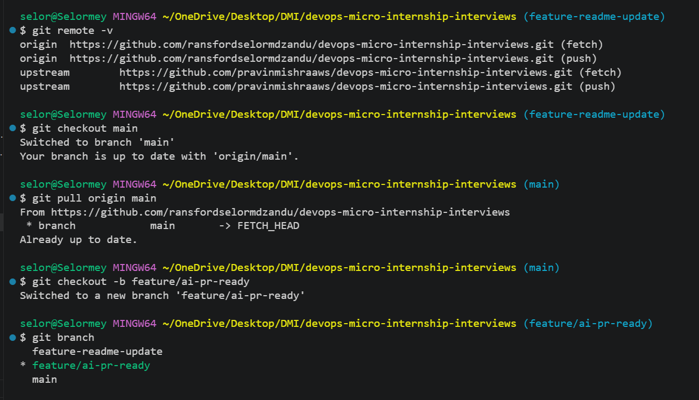
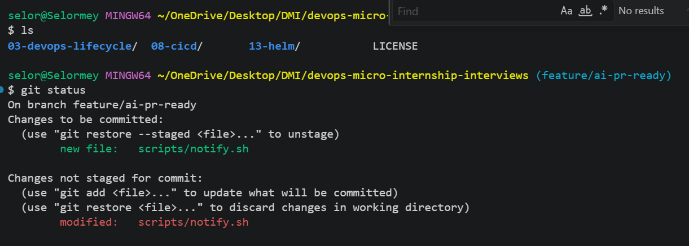
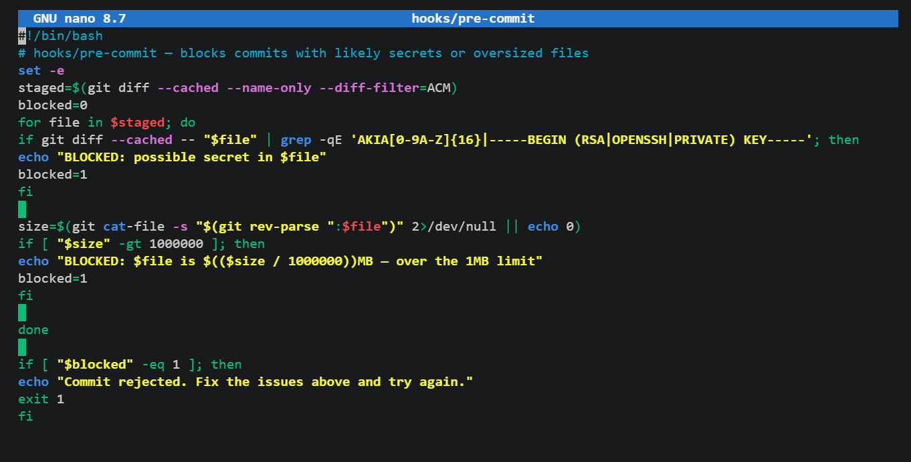
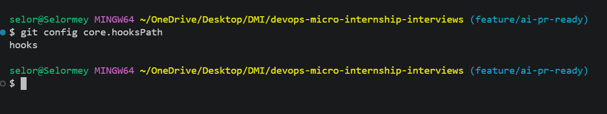
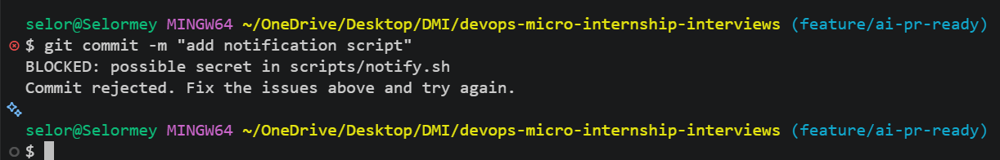
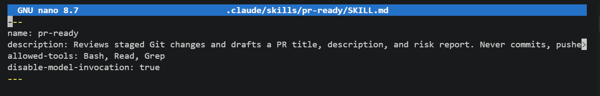
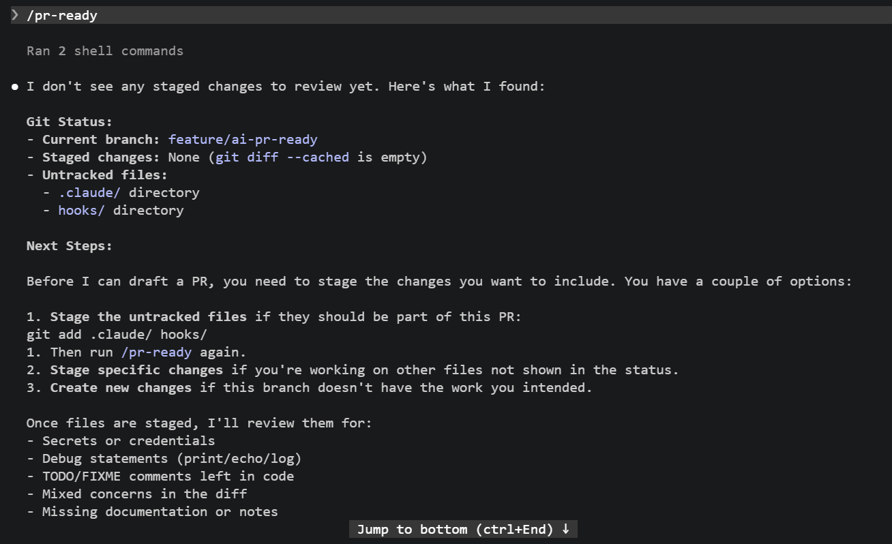
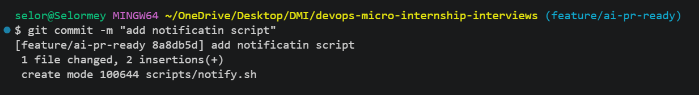
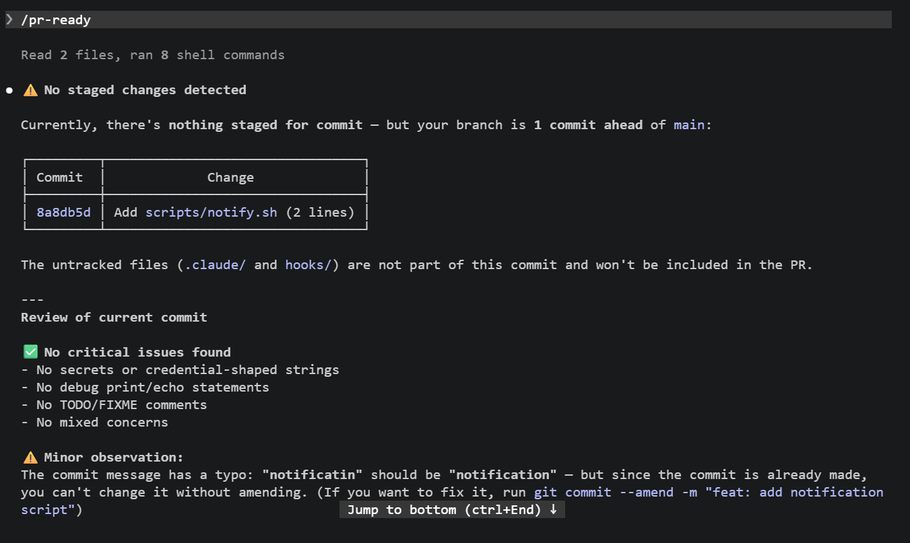
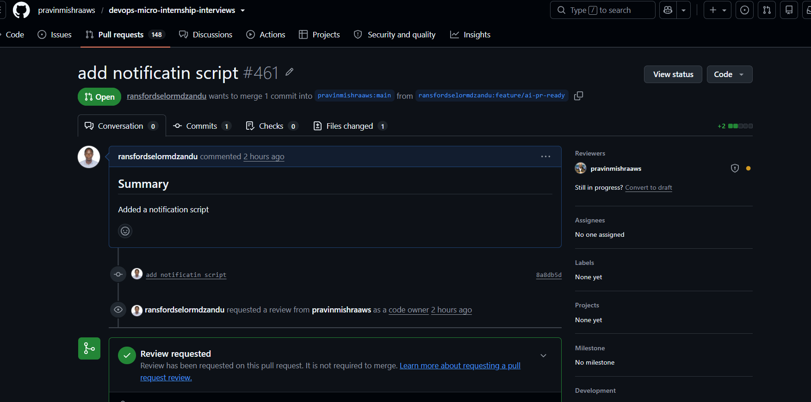

# Assignment 6 — Building an AI-Assisted Git Safety Net (PR Ready Check)

Part of the DevOps Micro Internship (DMI) Cohort 3 with Agentic AI

---

## Purpose

In Week 2 you built Claude Code hooks that block a dangerous action *before* it happens (`PreToolUse`), and a restricted skill that could look but not touch (`allowed-tools` without `Write`). In this assignment you will discover that Git has the exact same idea, decades older: a **pre-commit hook** that blocks a commit before it's created.

You will build both halves of a real "PR Ready" workflow:

1. A **Git hook that follows fixed rules** — scans staged changes for hardcoded secrets and oversized files and refuses the commit. No AI involved, no guessing, just a rule that gives the same answer every time.
2. A **restricted Claude Code skill** (`/pr-ready`) that reads your staged diff and drafts a Pull Request title, description, and a short list of things worth a second look — the kind of judgment a fixed rule can't make (mixed changes, missing context, unclear intent). The skill never commits, pushes, or opens the PR. You do that yourself, using its draft as a starting point.

This mirrors the Agentic Loop from Week 3's Linux triage assignment: **Gather → Analyze → Human Act → Verify**. The hook and the skill both gather and analyze; only you act.

---

# Task 0 — Confirm Your Fork and Create a Feature Branch

## Goal

Confirm you are working in your own fork, then create a dedicated branch for this assignment.

### Evidence

#### Screenshot 1 — Output of git remote -v and git branch showing the new branch

---

### Notes

**1. Why create a dedicated branch instead of doing this work on main?**

Creating a separate branch keeps your work isolated from the main branch. This allows the developer to develop, test, and make changes safely without affecting the stable version of the project. It aslo makes it easier to create a clean Pull Request that contains only the changes for this assignment.

---

# Task 1 — Stage a Change With Realistic Risk

## Goal

On your own fork of this repository (the one you've been submitting your DMI work in since onboarding), create a new branch and stage a change that a real reviewer should catch: a hardcoded-looking secret and a leftover debug statement.

### Evidence

#### Screenshot 1 — Output of  `git status` showing the staged file on feature/ai-pr-ready

---

### Notes

**1. Why does this assignment use an obviously fake key instead of a real one?**

Using a placeholder key forces the code to handle real-world failure states gracefully (e.g., catching 401 Unauthorized errors, triggering mock responses, or failing safely without crashing).

---

# Task 2 — Write a Real Git Pre-Commit Hook

## Goal

Create a tracked, shareable pre-commit hook that blocks a commit containing secret-like patterns or files over 1MB.

### Evidence

#### Screenshot 2 — `hooks/pre-commit` open in VS Code showing the full script

---

#### Screenshot 3 — Output of `git config core.hooksPath` confirming it points to `hooks`

---

### Notes

**1. Why is `hooks/pre-commit` tracked in the repo instead of living only in `.git/hooks/`?**

Team Standardization: It ensures every developer on the project runs the exact same pre-commit checks (such as secret scanning, linting, or formatting) before pushing code.

Version Control: Changes to hook logic are tracked in Git. Updates can be peer-reviewed through Pull Requests and rolled back if a script breaks.

Seamless Automation: Anyone who clones the repository automatically gets the hook code. A simple setup command (like git config core.hooksPath hooks or a post-install script) can instantly configure Git to use that folder for local hooks.

.git/hooks/ is local-only storage, while tracking hooks/pre-commit makes your security and quality checks shareable and maintainable across the entire team.

---

**2. Compare this to `PreToolUse` from Week 2 Assignment 6. What does each one intercept, and what do they have in common?**

What pre-commit Intercepts: Code you attempt to save to Git via git commit. It acts as a gatekeeper for your version control history.

What PreToolUse Intercepts: Actions the AI agent attempts to run (like running terminal commands or editing files). It acts as a gatekeeper for your system runtime.

What They Have in Common:

Both run before an action completes (pre-execution).

Both block invalid actions using error codes (non-zero exit).

Both enforce security and code quality automatically at the local level.

---

# Task 3 — Prove the Hook Blocks the Risky Commit

## Goal

Attempt to commit the staged file from Task 1 and show the hook rejecting it.

### Evidence

#### Screenshot 4 — Terminal showing `git commit` rejected with the hook's "BLOCKED" message naming the exact file

---

### Notes

**1. Which line in `hooks/pre-commit` matched your fake key, and why did it match?**

if git diff --cached -- "$file" | grep -qE 'AKIA[0-9A-Z]{16}|-----BEGIN (RSA|OPENSSH|PRIVATE) KEY-----'; 

The hook uses grep -qE to inspect staged changes against a regular expression targeting standard secret formats: AKIA followed by 16 alphanumeric characters (AWS Access Keys) or SSH/RSA private key headers. Because the fake key matched this structural pattern, the scanner flagged it as a credential purely based on its format.

---

**2. Could this hook have caught a poorly-named variable that stores a secret without the `AKIA` prefix? What does that tell you about the limits of a fixed rule like this?**

Why It Misses: The hook relies on a strict pattern (AKIA...). Secrets lacking this prefix—like generic variables, database passwords, or non-AWS keys (Stripe, GitHub, OpenAI)—will pass through undetected.

Core Limitation: Fixed regex rules are inflexible. They lack entropy analysis (detecting high-randomness strings) and contextual awareness (understanding variable intent), leaving major blind spots unless every single vendor pattern is manually coded into the script.

---

# Task 4 — Build the `/pr-ready` Skill

## Goal

Create a manually invoked Claude Code skill that reads your staged changes and produces a PR-readiness report and a draft PR description — without writing, committing, or pushing anything itself.

### Evidence

#### Screenshot 5 — `SKILL.md` frontmatter showing `allowed-tools: Bash, Read, Grep` (no `Write`) and `disable-model-invocation: true`

---

#### Screenshot 6 — `/pr-ready` output while the risky file is still staged, showing it flagged the secret and/or debug statement

---

### Notes

**1. Why does `/pr-ready` have `Bash` and `Read` but not `Write`?**

Audit-Only Focus: /pr-ready is designed strictly for non-destructive verification—using Read to inspect files and Bash to run tests and git checks.

Principle of Least Privilege: Omitting Write prevents the AI from making accidental or unauthorized file changes right before code is submitted.

---

**2. The pre-commit hook and `/pr-ready` both looked at the same staged diff. Did they flag the same things? What did one catch that the other didn't?**

Shared Overlap: Both flagged the fake AWS key by inspecting the staged git diff.

Caught by pre-commit Only: Oversized files (>1MB limit) and an enforceable hard block that directly prevents the Git commit from completing.

Caught by /pr-ready Only: Non-regex secrets (via semantic AI analysis), project metadata (e.g., SKILL.md frontmatter, README updates), and overall code quality and PR readiness.

---

# Task 5 — Fix the Issues and Re-Verify

## Goal

Remove the secret and debug statement, then prove both gates now pass clean.

### Evidence

#### Screenshot 7 — `git commit` succeeding after the fix (no BLOCKED message)

---

#### Screenshot 8 — Second `/pr-ready` run showing a clean risk report and a drafted PR title + description

---

### Notes

**1. What exactly did you change to satisfy the pre-commit hook?**

To satisfy the pre-commit hook, the following changes were made to the staged files:

Removed the Hardcoded Secret: Deleted the fake AWS access key (AKIA...) from the code.
Restaged the Changes: Ran git add to update the git index with the cleaned code so the hook could pass successfully on the next git commit attempt.

---

# Task 6 — Push and Open a Pull Request Using the AI Draft

## Goal

Push your branch and open a real Pull Request, using `/pr-ready`'s drafted title and description as your starting point — read it critically and edit before you use it.

**Important:** Open this Pull Request with base repository set to **your own fork** — not the shared upstream `pravinmishraaws/devops-micro-internship-pravinmishra` repository. This assignment's hook and skill files are your own practice work, not a change meant for the shared class repo.

### Evidence

#### Screenshot 9 — Your Pull Request showing the base repository is your own fork, plus the title and description, with the `/pr-ready` draft visible for comparison (paste it in the PR conversation or your notes below)

---

#### PR Link

https://github.com/pravinmishraaws/devops-micro-internship-interviews/pull/461

---

### Notes

**1. What, if anything, did you edit in the AI's drafted PR description before using it? Why?**

I did not edit the AI's drafted PR description before using it because the description accurately reflected the staged changes and the purpose of the assignment. I reviewed the AI-generated draft to ensure that it did not contain incorrect information, secrets, or unrelated changes. Since it was accurate and suitable for the Pull Request, I used it as drafted.

---

**2. If you had blindly copy-pasted the AI's draft without reading it, what could go wrong?**

If I had blindly copy-pasted the AI's draft without reading it, it could have contained inaccurate information, overlooked a secret or failed to mention an important risk in the staged changes. It could also have described changes that were not actually made or included unrelated information, resulting in a misleading Pull Request. Reviewing the AI's draft first ensures that I am aware of the final content and can correct any errors before using it.

---

**3. Why does this PR need to target your own fork instead of the shared upstream repository?**

This Pull Request must target my own fork because this assignment is an exercise in the working repository, not a contribution to the shared upstream repository. Using my fork as the base keeps the assignment changes isolated from the upstream project and prevents unrelated or personal assignment files from being submitted to the shared repository. 

---

# Task 7 — Map the Workflow to the Agentic Loop

## Goal

Explain this assignment's workflow using the same Gather → Analyze → Human Act → Verify structure from Week 3.

### Notes

**1. Which step(s) represent Gather?**

The Gather step is represented by reviewing the staged changes before opening the Pull Request. This includes running git diff --cached and git status to see exactly what has been staged. The /pr-ready skill then gathers information about possible secrets, credential-shaped strings, debug statements, TODO/FIXME comments, unrelated changes, and missing notes.

---

**2. Which step(s) represent Analyze?**

The Analyze step occurs when the pre-commit hook scans the staged files for issues such as exposed secrets, and when the /pr-ready AI skill reviews the staged diff, evaluates the changes, and generates a pull request summary with recommendations.

---

**3. Which step is Human Act, and why must a human — not Claude — run `git commit`, `git push`, and open the PR?**

The Human Act step is when the developer reviews the findings, runs git commit, pushes the branch to GitHub, and creates the pull request. These actions must be performed by a human because they change the repository, publish code, and represent an intentional decision that requires human approval and accountability.

---

**4. Which step is Verify?**

The Verify step is confirming that the commit was created successfully, the branch was pushed to GitHub, the pull request contains the correct changes and description, and all required checks have passed before the code is merged.

---

**5. In one or two sentences: why do you need *both* the fixed-rule pre-commit hook and the AI skill? Isn't one enough?**

Both are needed because they provide different layers of protection. The fixed-rule pre-commit hook reliably blocks specific, known patterns such as credential-shaped AWS keys, private keys, and oversized files, while the AI /pr-ready skill performs a broader contextual review for issues such as debug statements, TODO/FIXME comments, unrelated changes, and missing notes.

---

# Task 8 — LinkedIn Post

## Goal

Publish a LinkedIn post summarizing what you built and what you learned about combining fixed-rule safety checks with AI-assisted review.

### Evidence

#### LinkedIn Post URL

https://lnkd.in/p/d3Y6mixq

---

## Key Learnings

Add 3-5 bullet points on what you learned this week.

- Learned the difference between deterministic rule-based safety checks and AI-assisted contextual review, and why both are valuable in a secure development workflow.
a
- Learned how to apply the Gather → Analyze → Human Act → Verify Agentic Loop to a Git/GitHub workflow while keeping commits, pushes, and Pull Request creation under human control.

-Learned how Git pre-commit hooks and AI-assisted review complement each other by catching known issues and providing broader code review before code is committed.

---

# Submission Instructions

- Ensure `hooks/pre-commit` and `.claude/skills/pr-ready/SKILL.md` are committed to your GitHub repository
- Add all required screenshots to your submission
- All written answers must be in your own words
- Do not use a real secret or credential anywhere in your submission — the fake key in Task 1 is intentional and must stay clearly fake
- Open your Pull Request against your own fork, not the shared upstream repository
- Push your final changes to your forked repository
- Include your PR link and LinkedIn post URL

---

## GitHub Repository URL

Paste your forked repository URL here:

https://github.com/ransfordselormdzandu/devops-micro-internship-interviews.git

---

# Completion Checklist

- [ ] Branch `feature/ai-pr-ready` created with a staged file containing a fake secret and a debug statement
- [ ] `hooks/pre-commit` created and tracked in the repo (not only in `.git/hooks/`)
- [ ] `core.hooksPath` configured to point at `hooks/`
- [ ] Pre-commit hook shown blocking the risky commit
- [ ] `.claude/skills/pr-ready/SKILL.md` created with correct `allowed-tools` (no `Write`) and `disable-model-invocation: true`
- [ ] `/pr-ready` run against the risky diff and shown flagging issues
- [ ] Risky file fixed; `git commit` succeeds cleanly
- [ ] `/pr-ready` re-run showing a clean report and drafted PR title/description
- [ ] Pull Request opened using the AI draft as a starting point, with your own fork as the base repository (not upstream), PR link included
- [ ] Agentic Loop mapping (Task 7) completed in your own words
- [ ] LinkedIn post published and URL submitted
- [ ] All required screenshots added
- [ ] GitHub repository URL provided

---

## 📌 About DMI & CloudAdvisory

DevOps Micro Internship (DMI) is a project-based DevOps program run by Pravin Mishra (The CloudAdvisory) focused on real-world execution, systems thinking, and career readiness.

It helps learners build strong DevOps foundations with hands-on experience.

---

## 📌 Resources

- 🌐 DMI Official Website: https://pravinmishra.com/dmi  
- 🎓 DevOps for Beginners (Udemy): https://www.udemy.com/course/devops-for-beginners-docker-k8s-cloud-cicd-4-projects/  
- 🎓 Agentic AI DevOps with Claude Code: https://www.udemy.com/course/ultimate-agentic-ai-devops-with-claude-code/  
- 🎓 DevOps with Claude Code: Terraform, EKS, ArgoCD & Helm: https://www.udemy.com/course/devops-with-claude-code-terraform-eks-argocd-helm/  
- ▶️ YouTube Playlist: https://www.youtube.com/playlist?list=PLFeSNDtI4Cho  
- 🔗 Pravin Mishra (LinkedIn): https://www.linkedin.com/in/pravin-mishra-aws-trainer/  
- 🏢 CloudAdvisory (LinkedIn): https://www.linkedin.com/company/thecloudadvisory/

---

*This submission is part of DevOps Micro Internship (DMI) Cohort 3 — Agentic AI Track.*
