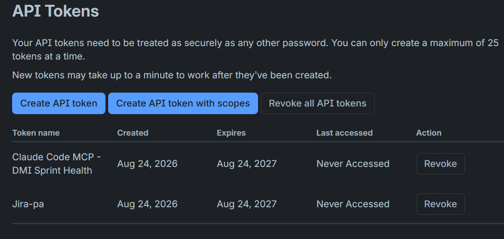
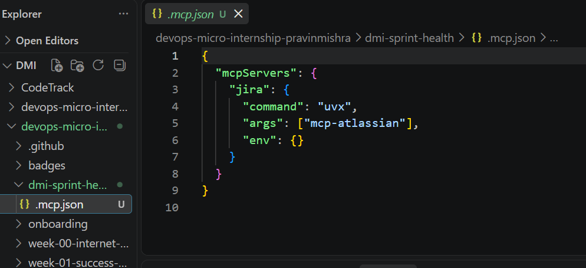
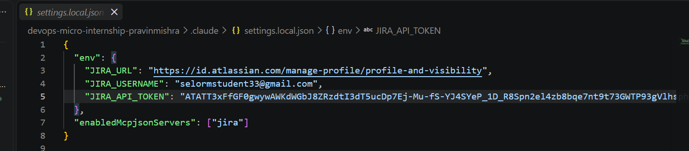
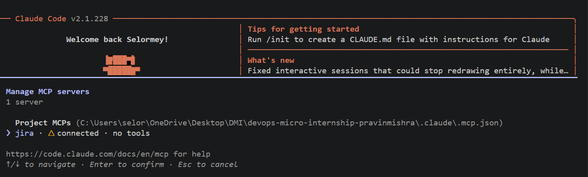
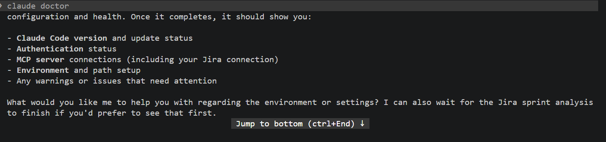
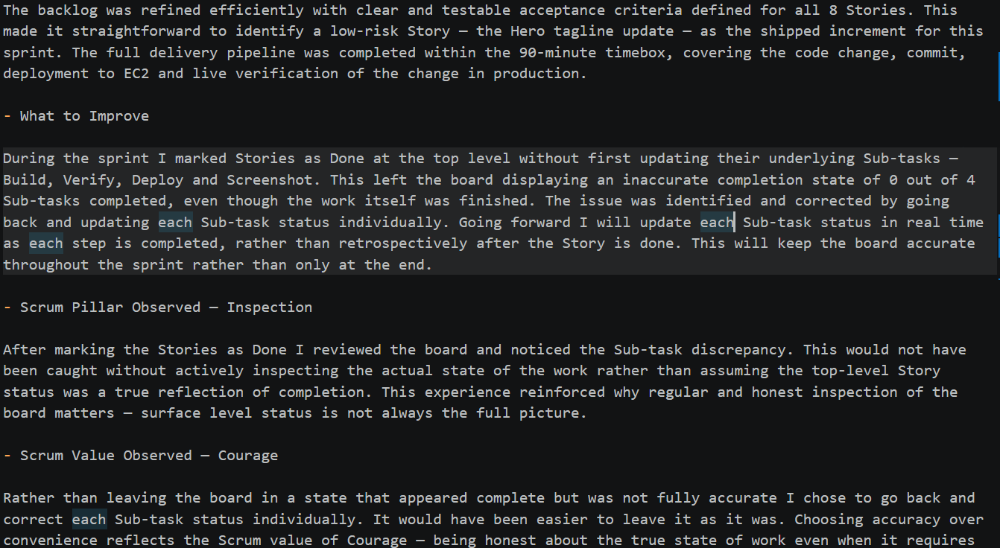
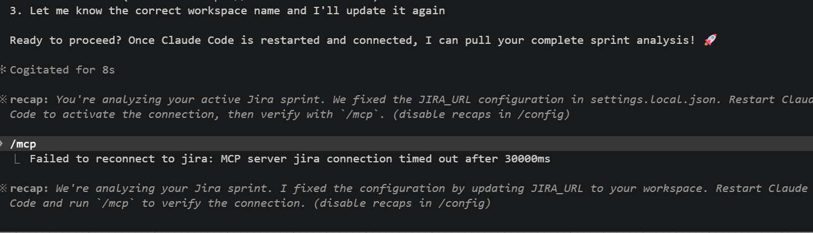

# Assignment 5 — AI-Assisted Sprint Health Report via Jira MCP

Part of the DevOps Micro Internship (DMI) Cohort 3 with Agentic AI

---

## Purpose

In this assignment, you will connect Claude Code to your Jira board through an MCP server, the same way you connected it to GitHub in Week 2, and build a read-only `/sprint-health` skill. The skill reads your current sprint through Jira's API and reports sprint velocity, stories at risk of missing the sprint, and items missing an estimate — but it must never create, edit, comment on, or transition a single ticket itself. You will prove that boundary holds by making a real change on the board yourself and confirming the skill only ever reports, never acts.

---

# Task 1 — Create a Jira API Token

## Goal

Generate an API token from your Atlassian account that the MCP server will use to authenticate with your Jira site. Do not screenshot the token value itself.

### Evidence

#### Screenshot 1 — Jira API token creation confirmation page showing the token name, with the token value not visible

### Notes You Must Write (Very Important):

Why does the MCP server need your site URL and account email in addition to the token?

Why the MCP Server Needs the Site URL, Email and API Token and  not Just the only the Token

Jira's REST API uses Basic Authentication, which requires three pieces of information working together — not just an API token on its own.

The API Token proves your identity. It acts as your secret credential confirming that the request is genuinely coming from you and not someone else.

The Email Address tells Jira which specific Atlassian account the token belongs to. Without it Jira cannot determine whose account is making the request, even if the token is valid.

The Site URL tells the MCP server which Jira instance to connect to. Atlassian hosts thousands of separate Jira instances and your instance at (your-site.atlassian.net) is completely separate from every other organisation's instance. Without the URL the server has no way of knowing which instance to talk to.

API Token proves who you are
Email identifies your specific account
Site URL points to your specific Jira instance

All three are required because Atlassian's authentication system is designed to be both secure and precise. The token alone is not enough to establish a connection — you need all three working together to successfully authenticate and reach the correct Jira environment.

# Task 2 — Create .mcp.json at the Project Root

## Goal

Create or update `.mcp.json` at your project root with a Jira MCP server block, following the same shape as the GitHub MCP server you configured in Week 2.

### Evidence

#### Screenshot 2 — `.mcp.json` open in VS Code showing the Jira server configuration

### Notes You Must Write (Very Important):

Compare this jira block to the github block from Week 2 Assignment 5. The GitHub server ran via npx (a Node.js package); this one runs via uvx (a Python package) — what stays exactly the same shape despite that difference, and why doesn't Claude Code care which language a given MCP server is written in?

The .mcp.json file acts as a registry that tells Claude Code which MCP servers exist and how to start them. Each server entry follows the same consistent structure — a name, a command, arguments and environment variables — regardless of what programming language the server is built in.

The key difference between the GitHub and Jira MCP blocks is the runner used to start them. GitHub uses npx because it is a Node.js package while Jira uses uvx because it is a Python package. Despite this difference the configuration block shape is identical for both.

Claude Code does not care which language an MCP server is written in because it never touches the source code. It only communicates through the Model Context Protocol which is a standardised interface. As long as the server speaks MCP, Claude Code can work with it regardless of how it was built.

Sensitive credentials like the API token, email and site URL are deliberately kept out of .mcp.json and stored in a separate configuration file to prevent them from being accidentally exposed in version control.

# Task 3 — Add Your Credentials to settings.local.json

## Goal

Add your Jira site URL, account email, and API token to `.claude/settings.local.json`, and confirm that file is listed in `.gitignore` so it is never committed.

### Evidence

#### Screenshot 3 — `settings.local.json` open in VS Code showing the `env` section, with the actual token value blurred or covered

### Notes You Must Write (Very Important):

Why must JIRA_API_TOKEN live in settings.local.json and never in .mcp.json?

The JIRA_API_TOKEN must live in settings.local.json and never in .mcp.json because of security.

.mcp.json is a project configuration file that gets committed to version control and pushed to GitHub. If your API token was stored there it could be publicly exposed — giving anyone who finds it full access to your Jira account.

settings.local.json is designed specifically for sensitive credentials. It is added to .gitignore which means version control ignores it completely and it never leaves your machine.

The rule is simple:
.mcp.json means configuration only = safe to commit
settings.local.json means credentials only  = never commit

Your API token is essentially your password. You would never write your password in a file you share publicly — the same principle applies here.

# Task 4 — Verify the Connection with /mcp

## Goal

Restart Claude Code and confirm the Jira MCP server shows as connected.

### Evidence

#### Screenshot 4 — `/mcp` output showing `jira: connected`

---

# Task 5 — Run a Live Query to Prove Real Board Data

## Goal

Ask Claude to list the issues in your current active sprint through the Jira MCP connection, and confirm the result matches what you see on your live board in the browser.

### Evidence

#### Screenshot 5 — Claude's response showing the live sprint issue list retrieved via Jira MCP

### Notes You Must Write (Very Important):

How did you confirm this was real board data and not something Claude guessed?

---

# Task 6 — Build the /sprint-health Skill

## Goal

Create a `/sprint-health` skill restricted to read-only Jira tools plus `Read`, with no issue-mutating tools and no `Write`. Run it and confirm it produces a report covering sprint velocity, at-risk stories, and items missing an estimate.

### Evidence

#### Screenshot 6 — `SKILL.md` frontmatter showing `allowed-tools` limited to read-only Jira tools plus `Read`, with `disable-model-invocation: true`

#### Screenshot 7 — `/sprint-health` output showing the full triage report against your real sprint

### Notes You Must Write (Very Important):

1. Which Jira MCP tools does this skill's allowed-tools list include, and which mutating tools (create issue, update issue, transition issue, add comment) does it deliberately exclude?

The sprint-health skill incorporates read-only retrieval tools such as jira_get_sprint (jira_list_sprints), jira_list_issues (jira_search_issues_jql), and jira_get_issue into its allowed-tools list, enabling it to safely query active sprint metadata, issue statuses, assignees, story points, and timestamps. To guarantee strict read-only execution and eliminate the risk of accidental board modifications, mutating tools including jira_create_issue, jira_update_issue, jira_transition_issue, and jira_add_comment are deliberately excluded. This configuration allows the skill to surface critical insights—such as unassigned tickets or inactive sprints—without generating new issues, altering fields, moving cards across workflow columns, or posting automated comments.

2. Why does a Scrum Master need this restriction more than almost any other role in this course?

A Scrum Master requires this strict read-only restriction because their role is grounded in coaching, facilitating, and maintaining process integrity rather than doing execution or direct management.

Preserving Team Autonomy and Ownership:
Scrum Masters facilitate self-organizing teams. If an automated skill automatically assigns issues, transitions statuses, or fills in story point estimates, it strips ownership away from the developers who actually commit to and perform the work.

Preventing Process Interference:
A Scrum Master must reflect the true, unvarnished state of the board back to the team. Unilateral or automated field modifications mask underlying execution or planning gaps instead of surfacing them during daily stand-ups or retrospectives.

Safeguarding Psychological Safety and Trust:
The Scrum Master acts as a servant-leader. If automated monitoring tools make board modifications, post auto-generated comments, or force status transitions, it creates an environment of micromanagement and algorithmic enforcement rather than a collaborative space focused on continuous improvement.

---

# Task 7 — Prove the Skill Never Mutates the Board

## Goal

Manually update one ticket on your board in the browser (for example, move a story to "Done" or add a missing estimate), then run `/sprint-health` again and confirm the new report reflects your change — proving the skill only ever reads live state and never wrote to the board itself.

### Evidence

#### Screenshot 8 — Second `/sprint-health` run showing the report now reflects your manual board change

### Notes You Must Write (Very Important):

Map this assignment to Gather → Analyze → Human Act → Verify from Week 3 Assignment 6. Which step did you perform manually in the browser, and why must that step stay human?

Workflow Cycle Breakdown: Gather → Analyze → Human Act → Verify
Gather: Executing the /sprint-health skill triggered permitted, read-only Jira MCP tools to extract real-time sprint data, including issue statuses, story point allocations, assignees, and update timestamps—straight from the project board.

Analyze: The skill processed the retrieved payload to measure current velocity, identify unestimated items, highlight stalled tasks, and compile an evidence-backed health summary.

Human Act: Taking the role of the human operator, I accessed the Jira web UI directly to transition DMIWMS-16 from "To Do" to "In Progress." Keeping this step manual is vital: determining when to begin work, shift priorities, or update ticket statuses demands human judgment that an AI should not assume or automate. While the tool can flag an inactive story, only a team member has the context to decide if it is ready to be moved.

Verify: A subsequent run of /sprint-health confirmed that the updated report accurately captured my manual status change. This validated that the skill's read-only guardrails remained intact following board updates, keeping data collection and analysis strictly isolated from state-modifying actions

---

# Submission Instructions

Complete all tasks in sequence.

Your submission must include:
- All 8 required screenshots
- All the required notes

---

# Completion Checklist

- [ ] Task 1: Jira API token created, value never screenshotted (Screenshot 1)
- [ ] Task 2: `.mcp.json` has the Jira server block (Screenshot 2)
- [ ] Task 3: Credentials stored in `settings.local.json`, token blurred, file gitignored (Screenshot 3)
- [ ] Task 4: `/mcp` shows the Jira server connected (Screenshot 4)
- [ ] Task 5: Live query returned real sprint data, verified against the browser (Screenshot 5)
- [ ] Task 6: `/sprint-health` skill created with correct read-only `allowed-tools`, and produced a full report (Screenshots 6–7)
- [ ] Task 7: A manual board change was reflected in a second `/sprint-health` run (Screenshot 8)
- [ ] Skill never created, edited, transitioned, or commented on any issue
- [ ] Reflection answered (Notes)
- [ ] No API token value exposed

---

## 📌 About DMI & CloudAdvisory

DevOps Micro Internship (DMI) is a project-based DevOps program run by Pravin Mishra (The CloudAdvisory) focused on real-world execution, systems thinking, and career readiness.

It helps learners build strong DevOps foundations with hands-on experience.

---

## 📌 Resources

- 🌐 DMI Official Website: https://dmi.pravinmishra.com?utm_source=github&utm_medium=readme  
- 🎓 University: https://university.pravinmishra.com?utm_source=github&utm_medium=readme  
- 💬 Discord Community: https://discord.pravinmishra.com?utm_source=github&utm_medium=readme  
- 📝 Blog: https://dmi.pravinmishra.com/blog?utm_source=github&utm_medium=readme  
- ▶️ YouTube Playlist: https://www.youtube.com/playlist?list=PLFeSNDtI4Cho  
- 🔗 Pravin Mishra (LinkedIn): https://www.linkedin.com/in/pravin-mishra-aws-trainer/  
- 🏢 CloudAdvisory (LinkedIn): https://www.linkedin.com/company/thecloudadvisory/

---

*This submission is part of DevOps Micro Internship (DMI) Cohort 3 — Agentic AI Track.*
